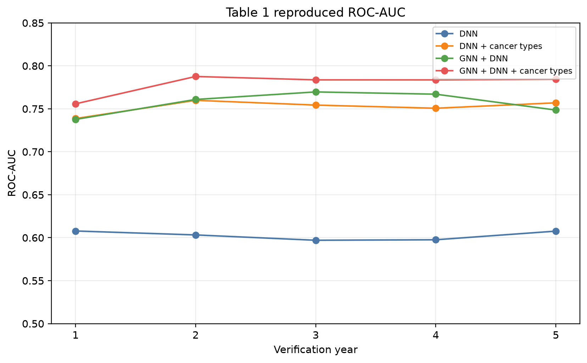
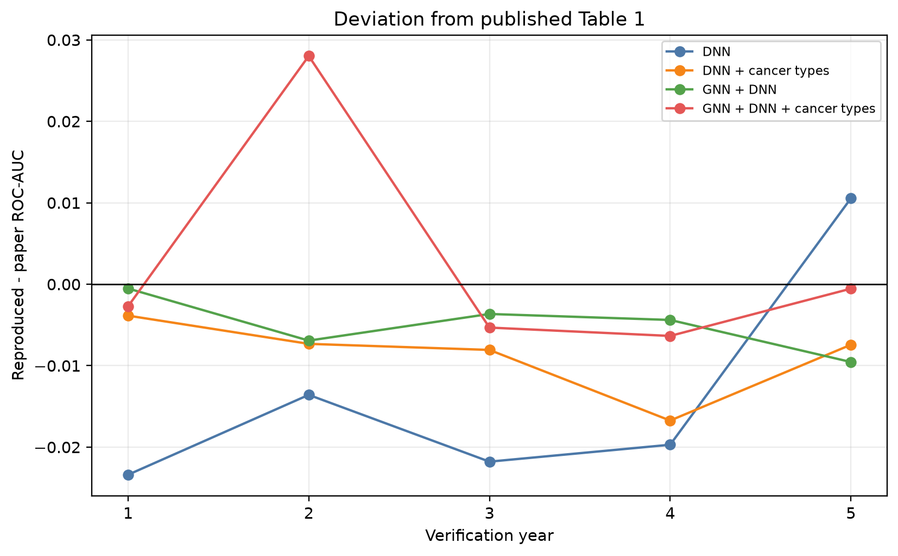
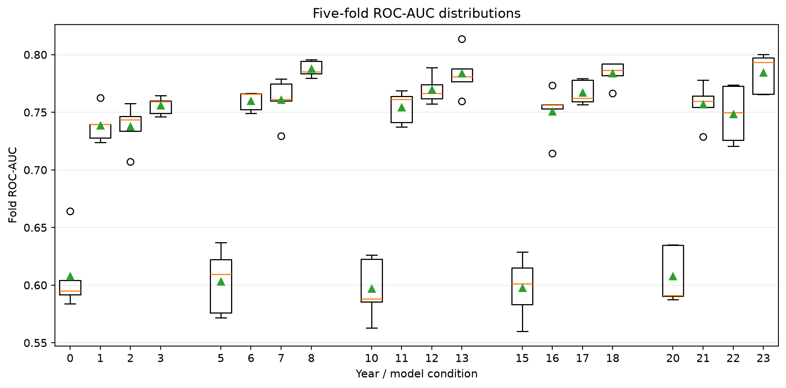
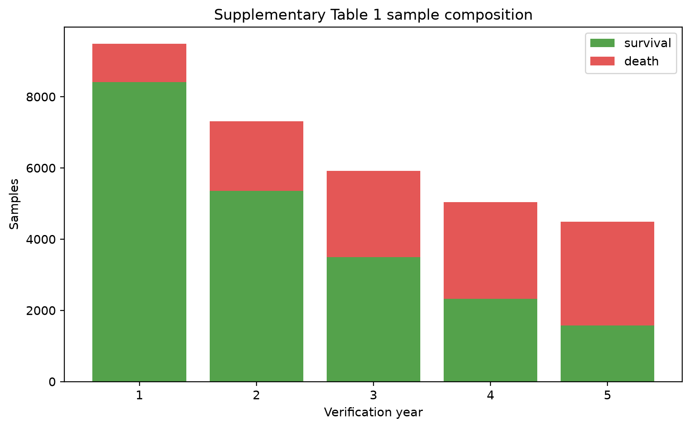
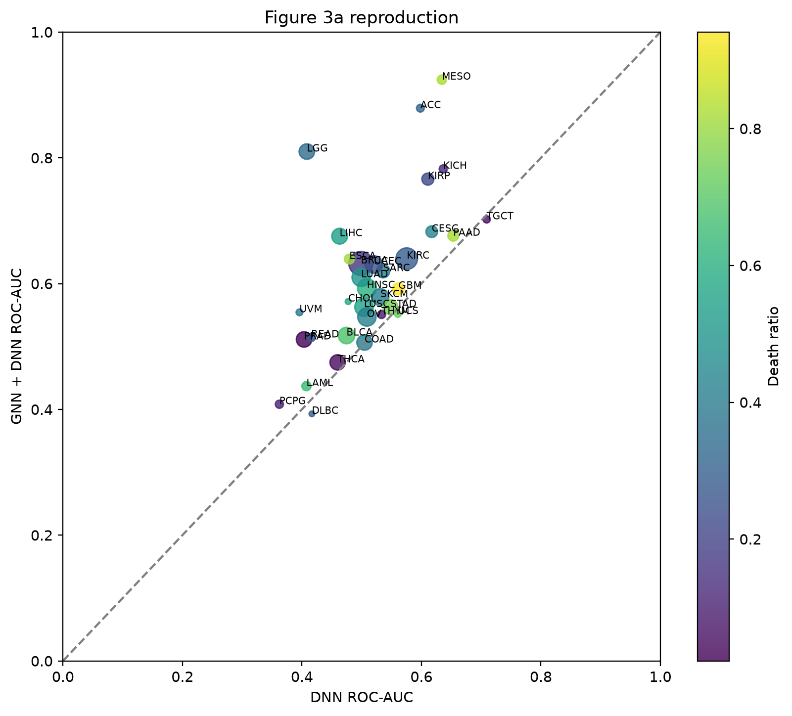
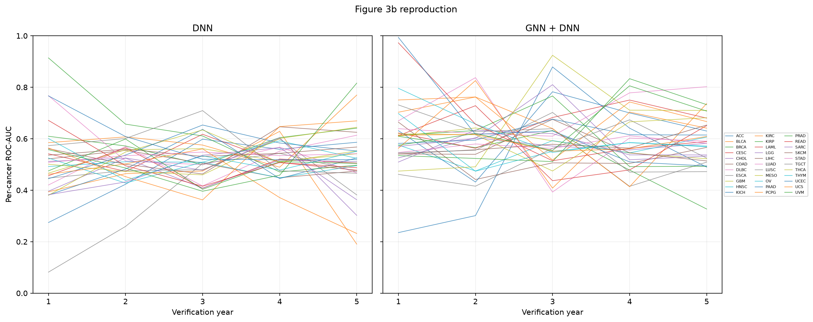
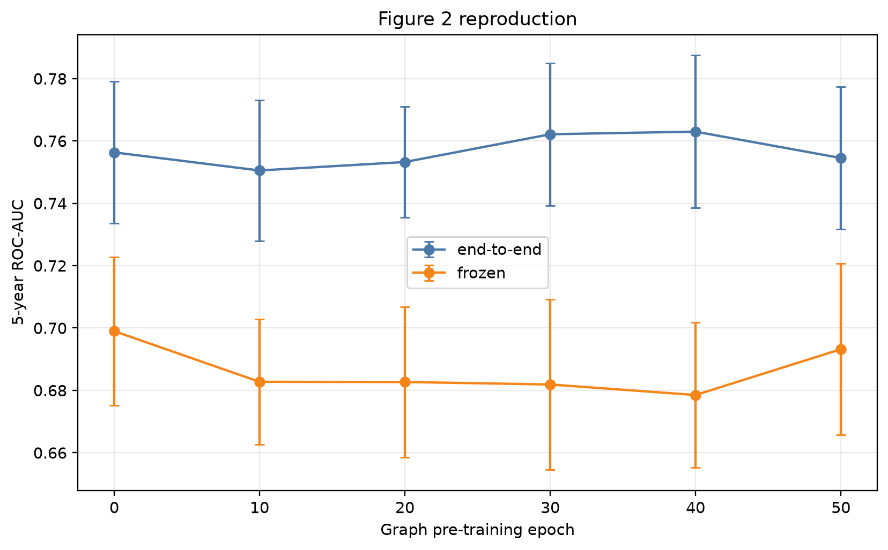
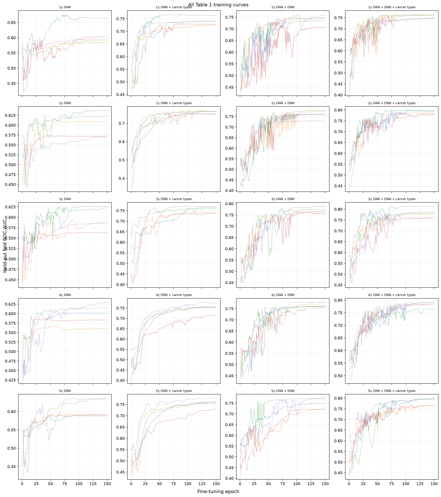
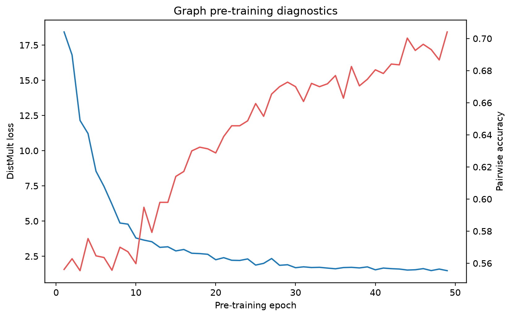
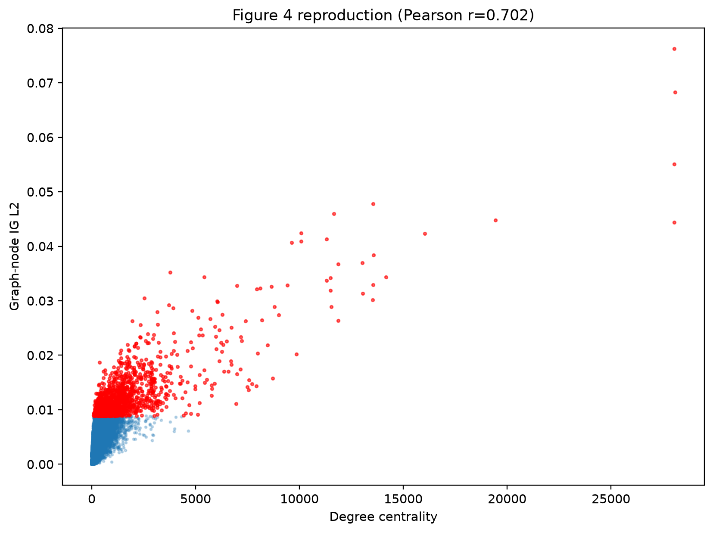

# Inoue et al. cancer prognosis reproduction

## Reproduction status

Table 1 grid status: **complete**. The workflow covers five verification years,
four model variants, five stratified folds, 150 fine-tuning epochs, and the
manuscript final-epoch evaluation protocol. Completed fold artifacts are reused.

## Table 1: published and reproduced ROC-AUC

| year | paper_dnn | reproduced_dnn | delta_dnn | paper_dnn_cancer | reproduced_dnn_cancer | delta_dnn_cancer | paper_gnn_dnn | reproduced_gnn_dnn | delta_gnn_dnn | paper_gnn_dnn_cancer | reproduced_gnn_dnn_cancer | delta_gnn_dnn_cancer |
|---|---|---|---|---|---|---|---|---|---|---|---|---|
| 1 | 0.6312 | 0.6078 | -0.0234 | 0.7425 | 0.7386 | -0.0039 | 0.7382 | 0.7377 | -0.0005 | 0.7585 | 0.7558 | -0.0027 |
| 2 | 0.6168 | 0.6032 | -0.0136 | 0.7672 | 0.7599 | -0.0073 | 0.7678 | 0.7609 | -0.0069 | 0.7596 | 0.7876 | 0.0280 |
| 3 | 0.6188 | 0.5970 | -0.0218 | 0.7624 | 0.7543 | -0.0081 | 0.7733 | 0.7696 | -0.0037 | 0.7890 | 0.7837 | -0.0053 |
| 4 | 0.6173 | 0.5976 | -0.0197 | 0.7674 | 0.7507 | -0.0167 | 0.7714 | 0.7670 | -0.0044 | 0.7900 | 0.7837 | -0.0063 |
| 5 | 0.5971 | 0.6076 | 0.0105 | 0.7644 | 0.7570 | -0.0074 | 0.7581 | 0.7486 | -0.0095 | 0.7850 | 0.7845 | -0.0005 |

NA means that a full condition has not completed. Fold values are exported to
outputs/cancer/report/table1_fold_auc.tsv.

## Supplementary Table 1: data audit

| year | total | death | survival |
|---|---|---|---|
| 1 | 9484 | 1076 | 8408 |
| 2 | 7308 | 1951 | 5357 |
| 3 | 5915 | 2425 | 3490 |
| 4 | 5036 | 2713 | 2323 |
| 5 | 4492 | 2922 | 1570 |

The prepared dataset contains 4,448 expression features, 33 cancer
types, and a graph with 30,918 stored nodes,
3,673,654 directed edges and 13 relations.
Cancer-level counts are in outputs/cancer/report/supplementary_table1_sample_counts.tsv.

## Reproduction plots

## Exact commands

    conda activate gnn
    bash scripts/cancer/reproduce_paper.sh prepare
    bash scripts/cancer/reproduce_paper.sh pretrain
    python scripts/cancer/reproduce_table1.py --gpus 0,1,2
    bash scripts/cancer/reproduce_paper.sh figure2
    bash scripts/cancer/reproduce_paper.sh ig
    bash scripts/cancer/reproduce_paper.sh report

Preprocessing is a separate step: `pathwaygnn-data cancer-prepare` writes the
generic dataset under data_cancer/prepared, and every `pathwaygnn` command then
selects it through the `dataset:` block of configs/cancer/dataset.yaml. The
Table 1 runner schedules all 20 conditions over GPUs and resumes at fold level.
selection: final_epoch follows the manuscript. best_test_auc is only for
public-code compatibility and uses the held-out fold for selection.

## Ensembl-to-HGNC conversion boundary

counts_gene.tsv contains 11,285 expression columns but no Ensembl identifier
row or column. A separately supplied ordered Ensembl ID file can be mapped by
`pathwaygnn-data cancer-map-ids` through MyGene.info, with version stripping,
ambiguity flags, and local cache files. Without that missing list and historical
MSigDB/LM22 snapshots, the supplied 4,448-gene matrices are the exact
compatibility input.

## Interpretation scope

The workflow generates Table 1, Supplementary Table 1, Figure 2 sweep, fold and cancer AUC
tables, Figure 3 panels, training diagnostics, and Figure 4 when attribution
arrays exist. Historical DAVID enrichment p-values depend on an external
database release; ranked gene lists are exported, but exact historical
p-values are not asserted.
