# PathwayGNN cancer drug-response report

## What this report covers

Dataset **cdr** — the GraphCDRScan corpus (GDSC1 dose response, Cell Model Passports
mutations, Reactome functional interactions) — prepared from
`/data1/kojima/PathwayGNN/PathwayGNN/data_cdr/processed/full_features` into `data_cdr/prepared`:
13,606 graph nodes, 536,274 directed edges,
356 relation types, 107,418 samples built from
760 cell lines x 168 compounds, tasks
sensitive_drugwise, sensitive_global. Run status: 8 cross-validation conditions, 2 holdout runs, 2 baseline runs, 2 attribution runs. Graph pre-training: 100 epochs, final DistMult loss 0.7109, final pairwise accuracy 0.9056.
Best cross-validated condition per task — sensitive_drugwise: gnn_mlp_cov 0.7226, sensitive_global: gnn_mlp_cov 0.9244.

A sample is one *(cell line, compound)* pair. Preprocessing turns the GDSC `LN_IC50` into a binary
label, because `pathwaygnn` trains binary problems only:

* **sensitive_drugwise** — 1 when `LN_IC50` is below the *same compound's* median. Every compound
  contributes ~50% positives, so the compound's overall potency carries no signal and the label can
  only be predicted from the cell line.
* **sensitive_global** — 1 when `LN_IC50` is below the median over all samples. Here the compound
  identity alone explains most of the label.

Each sample carries one sparse channel and one covariate vector:

* channel `mutation` — the number of mutations per Cancer-Gene-Census gene of the cell line, indexed
  by graph node. Because the profile depends only on the cell line, the
  107,418 samples share 760
  distinct rows through `rows/mutation.npy`.
* covariates — the GraphCDRScan sample-feature vector verbatim: the 96/78/83-context mutational
  spectra of the cell line, its primary-site one-hot and the 3 x 1024-bit RDKit compound
  fingerprint (3,348 values).

Every number below comes from artifacts under `outputs/cdr/`, and every table is also written as TSV
under `outputs/cdr/report/`. Cross-validation and the graph-free baselines use the same stratified 5-fold
split (seed 42, `StratifiedKFold(shuffle=True)`), so those model comparisons are on identical folds;
attribution runs on fold 0 of `gnn_mlp_cov`, and holdout fine-tuning uses its own 70/15/15 split.

## Dataset audit

| task | samples | positive | positive_ratio | cell_lines | compounds | sites_used | sites_total | covariates | mutation_rows | mean_genes_mutation | label_reference |
|---|---|---|---|---|---|---|---|---|---|---|---|
| sensitive_drugwise | 107418 | 53669 | 0.4996 | 760 | 168 | 19 | 19 | 3348 | 760 | 155.1053 | median LN_IC50 of the same compound |
| sensitive_global | 107418 | 53709 | 0.5000 | 760 | 168 | 19 | 19 | 3348 | 760 | 155.1053 | median LN_IC50 over every sample |

`mutation_rows` is the number of distinct mutation profiles the channel stores, and
`mean_genes_mutation` the mean number of mutated census genes per profile. `sites_used` counts the
primary sites that actually appear, out of `sites_total` in the one-hot block.

## Cross-validation (`pathwaygnn cv`)

| task | variant | uses_graph | uses_covariates | mean_auc | std_auc | mean_accuracy | mean_precision | mean_recall | mean_f1 | min_fold_auc | max_fold_auc | pooled_auc | folds |
|---|---|---|---|---|---|---|---|---|---|---|---|---|---|
| sensitive_drugwise | mlp | False | False | 0.5160 | 0.0137 | 0.5113 | 0.4306 | 0.2989 | 0.3028 | 0.4950 | 0.5308 | 0.5169 | 5 |
| sensitive_drugwise | mlp_cov | False | True | 0.7183 | 0.0022 | 0.6558 | 0.6929 | 0.5587 | 0.6185 | 0.7159 | 0.7220 | 0.7181 | 5 |
| sensitive_drugwise | gnn_mlp | True | False | 0.5509 | 0.0511 | 0.5330 | 0.5668 | 0.5782 | 0.5030 | 0.4866 | 0.6195 | 0.5578 | 5 |
| sensitive_drugwise | gnn_mlp_cov | True | True | 0.7226 | 0.0064 | 0.6578 | 0.6881 | 0.5784 | 0.6277 | 0.7148 | 0.7336 | 0.7222 | 5 |
| sensitive_global | mlp | False | False | 0.5017 | 0.0057 | 0.4992 | 0.3014 | 0.3091 | 0.2605 | 0.4909 | 0.5064 | 0.4998 | 5 |
| sensitive_global | mlp_cov | False | True | 0.9243 | 0.0007 | 0.8394 | 0.8398 | 0.8388 | 0.8393 | 0.9235 | 0.9253 | 0.9241 | 5 |
| sensitive_global | gnn_mlp | True | False | 0.5070 | 0.0065 | 0.5023 | 0.4276 | 0.2569 | 0.2312 | 0.4952 | 0.5142 | 0.5076 | 5 |
| sensitive_global | gnn_mlp_cov | True | True | 0.9244 | 0.0015 | 0.8400 | 0.8439 | 0.8345 | 0.8391 | 0.9221 | 0.9264 | 0.9243 | 5 |

`pooled_auc` is computed once over the concatenated held-out predictions of all folds, which is why
it can sit outside the min/max of the per-fold values. The `mean_accuracy`/`precision`/`recall`/`f1`
columns score the same folds at a fixed **0.5 decision threshold**; ROC-AUC is threshold-free, so a
condition can rank well and still sit at a poor operating point (or the reverse).

`cv` trains with an unweighted BCE loss — unlike `finetune`, which applies `pos_weight` — so on imbalanced labels the 0.5 operating point would drift towards the majority class. Both tasks here are ~50% positive by construction, so accuracy and F1 stay interpretable.

The grid is a two-factor ablation — the pathway graph on/off crossed with the covariate branch
on/off — so each switch can be read with the other held fixed:

| task | factor | held_fixed | off_variant | off_auc | on_variant | on_auc | delta |
|---|---|---|---|---|---|---|---|
| sensitive_drugwise | graph encoder | use_covariates=False | mlp | 0.5160 | gnn_mlp | 0.5509 | 0.0350 |
| sensitive_drugwise | graph encoder | use_covariates=True | mlp_cov | 0.7183 | gnn_mlp_cov | 0.7226 | 0.0043 |
| sensitive_drugwise | covariates | use_graph=False | mlp | 0.5160 | mlp_cov | 0.7183 | 0.2024 |
| sensitive_drugwise | covariates | use_graph=True | gnn_mlp | 0.5509 | gnn_mlp_cov | 0.7226 | 0.1717 |
| sensitive_global | graph encoder | use_covariates=False | mlp | 0.5017 | gnn_mlp | 0.5070 | 0.0054 |
| sensitive_global | graph encoder | use_covariates=True | mlp_cov | 0.9243 | gnn_mlp_cov | 0.9244 | 0.0001 |
| sensitive_global | covariates | use_graph=False | mlp | 0.5017 | mlp_cov | 0.9243 | 0.4226 |
| sensitive_global | covariates | use_graph=True | gnn_mlp | 0.5070 | gnn_mlp_cov | 0.9244 | 0.4174 |

The `covariates` rows are large by construction: the covariate block carries the compound
fingerprint, and `sensitive_global` is mostly a question about the compound. The rows that speak to
the pathway graph are the `graph encoder` ones, and they are only informative where the mutation
channel is the model's *only* view of the sample (`use_covariates=False`) — with the covariates on,
the graph has little left to add.

## Graph-free baselines (`pathwaygnn benchmark`)

| task | model | auc | accuracy | precision | recall | f1 |
|---|---|---|---|---|---|---|
| sensitive_drugwise | logistic_regression | 0.7090 | 0.6561 | 0.6626 | 0.6352 | 0.6485 |
| sensitive_drugwise | random_forest | 0.7355 | 0.6770 | 0.6929 | 0.6350 | 0.6626 |
| sensitive_drugwise | xgboost | 0.7582 | 0.6880 | 0.6998 | 0.6575 | 0.6780 |
| sensitive_drugwise | mlp (pathwaygnn cv) | 0.5160 | 0.5113 | 0.4306 | 0.2989 | 0.3028 |
| sensitive_drugwise | mlp_cov (pathwaygnn cv) | 0.7183 | 0.6558 | 0.6929 | 0.5587 | 0.6185 |
| sensitive_drugwise | gnn_mlp (pathwaygnn cv) | 0.5509 | 0.5330 | 0.5668 | 0.5782 | 0.5030 |
| sensitive_drugwise | gnn_mlp_cov (pathwaygnn cv) | 0.7226 | 0.6578 | 0.6881 | 0.5784 | 0.6277 |
| sensitive_global | logistic_regression | 0.9216 | 0.8384 | 0.8391 | 0.8374 | 0.8382 |
| sensitive_global | random_forest | 0.9061 | 0.8204 | 0.8233 | 0.8161 | 0.8196 |
| sensitive_global | xgboost | 0.9330 | 0.8510 | 0.8535 | 0.8476 | 0.8505 |
| sensitive_global | mlp (pathwaygnn cv) | 0.5017 | 0.4992 | 0.3014 | 0.3091 | 0.2605 |
| sensitive_global | mlp_cov (pathwaygnn cv) | 0.9243 | 0.8394 | 0.8398 | 0.8388 | 0.8393 |
| sensitive_global | gnn_mlp (pathwaygnn cv) | 0.5070 | 0.5023 | 0.4276 | 0.2569 | 0.2312 |
| sensitive_global | gnn_mlp_cov (pathwaygnn cv) | 0.9244 | 0.8400 | 0.8439 | 0.8345 | 0.8391 |

The baselines consume exactly the same features as the GNN — the mutation channel expanded to
`[samples, 13,606]` plus the covariate block — without the pathway graph. All five
metrics are on the same footing: both sides are the mean over the same five folds, and both
threshold at 0.5. These are reference points, not tuned models: the features are unscaled
counts and raw bits, so `LogisticRegression` hits its `max_iter=1000` lbfgs limit without
converging, and the forest is capped at 60 trees of depth 12 to finish on a
107,418 x 16,954 matrix.

## Holdout fine-tuning (`pathwaygnn finetune`)

| task | train | valid | test | epochs_run | best_epoch | best_valid_auc | test_auc | test_accuracy | test_precision | test_recall | test_f1 | test_predicted_positive_ratio |
|---|---|---|---|---|---|---|---|---|---|---|---|---|
| sensitive_drugwise | 75192 | 16112 | 16114 | 40 | 40 | 0.7365 | 0.7306 | 0.6636 | 0.6907 | 0.5917 | 0.6374 | 0.4280 |
| sensitive_global | 75192 | 16112 | 16114 | 40 | 38 | 0.9222 | 0.9229 | 0.8368 | 0.8470 | 0.8223 | 0.8344 | 0.4854 |

This protocol is a single stratified 70/15/15 split of `gnn_mlp_cov` with early stopping on
validation ROC-AUC and `pos_weight` from the training class ratio, so its numbers are not directly
comparable with the 5-fold results above.

## Per primary site

| task | primary_site | samples | positives | auc_mlp | auc_mlp_cov | auc_gnn_mlp | auc_gnn_mlp_cov |
|---|---|---|---|---|---|---|---|
| sensitive_drugwise | Lung | 21696 | 8683 | 0.5176 | 0.6632 | 0.5326 | 0.6631 |
| sensitive_drugwise | Haematopoietic and Lymphoid | 17092 | 12869 | 0.5193 | 0.7709 | 0.5538 | 0.7752 |
| sensitive_drugwise | Skin | 7841 | 3814 | 0.5278 | 0.6836 | 0.5258 | 0.6925 |
| sensitive_drugwise | Central Nervous System | 7420 | 3581 | 0.5104 | 0.6499 | 0.5518 | 0.6560 |
| sensitive_drugwise | Breast | 7103 | 2770 | 0.5148 | 0.6439 | 0.5151 | 0.6342 |
| sensitive_drugwise | Large Intestine | 6422 | 2422 | 0.5712 | 0.7224 | 0.5516 | 0.7322 |
| sensitive_drugwise | Head and Neck | 5487 | 2935 | 0.4921 | 0.6700 | 0.5216 | 0.6842 |
| sensitive_drugwise | Esophagus | 4947 | 2406 | 0.4975 | 0.6980 | 0.5011 | 0.6858 |
| sensitive_drugwise | Peripheral Nervous System | 4703 | 2400 | 0.5176 | 0.6397 | 0.5698 | 0.6608 |
| sensitive_drugwise | Kidney | 4403 | 2120 | 0.5321 | 0.6338 | 0.5268 | 0.6585 |
| sensitive_drugwise | Ovary | 4156 | 1866 | 0.5015 | 0.6310 | 0.5672 | 0.6594 |
| sensitive_drugwise | Pancreas | 3887 | 1665 | 0.4717 | 0.6586 | 0.5378 | 0.6831 |
| sensitive_drugwise | Stomach | 3109 | 1445 | 0.5504 | 0.6787 | 0.5497 | 0.6738 |
| sensitive_drugwise | Bladder | 2576 | 1314 | 0.5186 | 0.6798 | 0.5327 | 0.6798 |
| sensitive_drugwise | Thyroid | 2290 | 1291 | 0.5104 | 0.6622 | 0.5500 | 0.6961 |
| sensitive_drugwise | Liver | 2180 | 1093 | 0.5367 | 0.6242 | 0.5031 | 0.6102 |
| sensitive_drugwise | Cervix | 1828 | 791 | 0.4701 | 0.7312 | 0.5847 | 0.7323 |
| sensitive_drugwise | Vulva | 141 | 77 | 0.5532 | 0.7116 | 0.4616 | 0.7445 |
| sensitive_drugwise | Bone | 137 | 127 | 0.5803 | 0.7362 | 0.4551 | 0.6882 |
| sensitive_global | Lung | 21696 | 9711 | 0.4949 | 0.9166 | 0.5016 | 0.9178 |
| sensitive_global | Haematopoietic and Lymphoid | 17092 | 11097 | 0.5075 | 0.9189 | 0.5038 | 0.9196 |
| sensitive_global | Skin | 7841 | 3852 | 0.5046 | 0.9249 | 0.5122 | 0.9245 |
| sensitive_global | Central Nervous System | 7420 | 3629 | 0.4966 | 0.9249 | 0.4927 | 0.9249 |
| sensitive_global | Breast | 7103 | 3144 | 0.4994 | 0.9189 | 0.5143 | 0.9199 |
| sensitive_global | Large Intestine | 6422 | 2730 | 0.4829 | 0.9245 | 0.5184 | 0.9253 |
| sensitive_global | Head and Neck | 5487 | 2773 | 0.4985 | 0.9349 | 0.4990 | 0.9353 |
| sensitive_global | Esophagus | 4947 | 2385 | 0.5147 | 0.9243 | 0.5054 | 0.9223 |
| sensitive_global | Peripheral Nervous System | 4703 | 2455 | 0.4962 | 0.9037 | 0.4971 | 0.9030 |
| sensitive_global | Kidney | 4403 | 2172 | 0.5074 | 0.9179 | 0.5122 | 0.9184 |
| sensitive_global | Ovary | 4156 | 1895 | 0.4857 | 0.9271 | 0.5073 | 0.9266 |
| sensitive_global | Pancreas | 3887 | 1830 | 0.4976 | 0.9304 | 0.5182 | 0.9295 |
| sensitive_global | Stomach | 3109 | 1495 | 0.4964 | 0.9194 | 0.4813 | 0.9171 |
| sensitive_global | Bladder | 2576 | 1266 | 0.4959 | 0.9282 | 0.4987 | 0.9294 |
| sensitive_global | Thyroid | 2290 | 1192 | 0.5186 | 0.9285 | 0.5079 | 0.9276 |
| sensitive_global | Liver | 2180 | 1097 | 0.4992 | 0.9326 | 0.5037 | 0.9327 |
| sensitive_global | Cervix | 1828 | 817 | 0.5258 | 0.9359 | 0.5236 | 0.9373 |
| sensitive_global | Vulva | 141 | 71 | 0.5202 | 0.9696 | 0.4385 | 0.9632 |
| sensitive_global | Bone | 137 | 98 | 0.5310 | 0.9495 | 0.4504 | 0.9401 |

The full table is in `outputs/cdr/report/per_site_auc.tsv`. Per-site ROC-AUC is undefined wherever a site's
held-out samples are single-class, and is reported as NA in that case.

## Integrated Gradients (`pathwaygnn ig`)

Top attributed graph nodes (HGNC ids resolved to approved symbols through
`data_cdr/raw/EnsemblToHGNC.tsv`):

| task | rank | node | ig_l2 | degree |
|---|---|---|---|---|
| sensitive_drugwise | 1 | UBC (HGNC:12468) | 0.0116 | 1664 |
| sensitive_drugwise | 2 | RPS27A (HGNC:10417) | 0.0109 | 2050 |
| sensitive_drugwise | 3 | UBA52 (HGNC:12458) | 0.0097 | 1962 |
| sensitive_drugwise | 4 | GRB2 (HGNC:4566) | 0.0088 | 922 |
| sensitive_drugwise | 5 | UBB (HGNC:12463) | 0.0086 | 1684 |
| sensitive_drugwise | 6 | PIK3CA (HGNC:8975) | 0.0083 | 758 |
| sensitive_drugwise | 7 | ACTB (HGNC:132) | 0.0080 | 798 |
| sensitive_drugwise | 8 | PIK3R1 (HGNC:8979) | 0.0080 | 820 |
| sensitive_drugwise | 9 | EP300 (HGNC:3373) | 0.0075 | 2114 |
| sensitive_drugwise | 10 | SP1 (HGNC:11205) | 0.0073 | 1244 |
| sensitive_drugwise | 11 | DYNC1I2 (HGNC:2964) | 0.0072 | 686 |
| sensitive_drugwise | 12 | PIK3CB (HGNC:8976) | 0.0068 | 494 |
| sensitive_drugwise | 13 | GAB2 (HGNC:14458) | 0.0068 | 400 |
| sensitive_drugwise | 14 | FYN (HGNC:4037) | 0.0067 | 846 |
| sensitive_drugwise | 15 | POLR2C (HGNC:9189) | 0.0066 | 936 |
| sensitive_drugwise | 16 | PLCG1 (HGNC:9065) | 0.0066 | 590 |
| sensitive_drugwise | 17 | HSPA8 (HGNC:5241) | 0.0059 | 1356 |
| sensitive_drugwise | 18 | RPA1 (HGNC:10289) | 0.0056 | 750 |
| sensitive_drugwise | 19 | ACTG1 (HGNC:144) | 0.0056 | 560 |
| sensitive_drugwise | 20 | ACTBL2 (HGNC:17780) | 0.0056 | 452 |
| sensitive_global | 1 | UBA52 (HGNC:12458) | 0.0017 | 1962 |
| sensitive_global | 2 | UBC (HGNC:12468) | 0.0015 | 1664 |
| sensitive_global | 3 | GRB2 (HGNC:4566) | 0.0013 | 922 |
| sensitive_global | 4 | ACTB (HGNC:132) | 0.0013 | 798 |
| sensitive_global | 5 | PIK3CA (HGNC:8975) | 0.0012 | 758 |
| sensitive_global | 6 | EP300 (HGNC:3373) | 0.0011 | 2114 |
| sensitive_global | 7 | PIK3R1 (HGNC:8979) | 0.0011 | 820 |
| sensitive_global | 8 | DYNC1I2 (HGNC:2964) | 0.0011 | 686 |
| sensitive_global | 9 | RPS27A (HGNC:10417) | 0.0011 | 2050 |
| sensitive_global | 10 | UBB (HGNC:12463) | 0.0010 | 1684 |
| sensitive_global | 11 | PIK3CB (HGNC:8976) | 0.0010 | 494 |
| sensitive_global | 12 | ACTG1 (HGNC:144) | 0.0010 | 560 |
| sensitive_global | 13 | NCBP2 (HGNC:7659) | 0.0009 | 996 |
| sensitive_global | 14 | NUP107 (HGNC:29914) | 0.0009 | 462 |
| sensitive_global | 15 | PLCG1 (HGNC:9065) | 0.0009 | 590 |
| sensitive_global | 16 | RPS27 (HGNC:10416) | 0.0009 | 714 |
| sensitive_global | 17 | CBL (HGNC:1541) | 0.0009 | 516 |
| sensitive_global | 18 | HDAC1 (HGNC:4852) | 0.0009 | 820 |
| sensitive_global | 19 | SMARCC2 (HGNC:11105) | 0.0009 | 438 |
| sensitive_global | 20 | PARP1 (HGNC:270) | 0.0009 | 436 |

Top 10 attributed genes of the `mutation` channel:

| task | channel | rank | node | signed_ig |
|---|---|---|---|---|
| sensitive_drugwise | mutation | 1 | NCOR2 (HGNC:7673) | -0.0020 |
| sensitive_drugwise | mutation | 2 | ATM (HGNC:795) | -0.0017 |
| sensitive_drugwise | mutation | 3 | EP300 (HGNC:3373) | -0.0017 |
| sensitive_drugwise | mutation | 4 | PABPC1 (HGNC:8554) | -0.0016 |
| sensitive_drugwise | mutation | 5 | USP6 (HGNC:12629) | 0.0015 |
| sensitive_drugwise | mutation | 6 | RNF213 (HGNC:14539) | -0.0015 |
| sensitive_drugwise | mutation | 7 | LRP1B (HGNC:6693) | 0.0014 |
| sensitive_drugwise | mutation | 8 | BIRC6 (HGNC:13516) | 0.0014 |
| sensitive_drugwise | mutation | 9 | CNTNAP2 (HGNC:13830) | 0.0012 |
| sensitive_drugwise | mutation | 10 | PTPRD (HGNC:9668) | 0.0012 |
| sensitive_global | mutation | 1 | MUC4 (HGNC:7514) | -0.0025 |
| sensitive_global | mutation | 2 | MUC16 (HGNC:15582) | -0.0024 |
| sensitive_global | mutation | 3 | KMT2C (HGNC:13726) | -0.0022 |
| sensitive_global | mutation | 4 | PABPC1 (HGNC:8554) | -0.0018 |
| sensitive_global | mutation | 5 | LRP1B (HGNC:6693) | -0.0014 |
| sensitive_global | mutation | 6 | PTPRT (HGNC:9682) | -0.0011 |
| sensitive_global | mutation | 7 | BIRC6 (HGNC:13516) | -0.0011 |
| sensitive_global | mutation | 8 | CAMTA1 (HGNC:18806) | -0.0010 |
| sensitive_global | mutation | 9 | DCC (HGNC:2701) | -0.0010 |
| sensitive_global | mutation | 10 | TRRAP (HGNC:12347) | -0.0009 |

Top 10 attributed covariates:

| task | rank | covariate | signed_ig |
|---|---|---|---|
| sensitive_drugwise | 1 | site_Thyroid | 0.0092 |
| sensitive_drugwise | 2 | spectra96_4 | -0.0083 |
| sensitive_drugwise | 3 | spectra78_28 | -0.0060 |
| sensitive_drugwise | 4 | spectra96_44 | -0.0056 |
| sensitive_drugwise | 5 | site_Haematopoietic and Lymphoid | 0.0052 |
| sensitive_drugwise | 6 | spectra78_69 | -0.0052 |
| sensitive_drugwise | 7 | spectra96_40 | -0.0050 |
| sensitive_drugwise | 8 | site_Large Intestine | 0.0050 |
| sensitive_drugwise | 9 | spectra96_35 | -0.0041 |
| sensitive_drugwise | 10 | spectra96_9 | -0.0041 |
| sensitive_global | 1 | spectra96_4 | -0.0125 |
| sensitive_global | 2 | spectra78_21 | -0.0116 |
| sensitive_global | 3 | spectra78_36 | -0.0115 |
| sensitive_global | 4 | site_Large Intestine | 0.0115 |
| sensitive_global | 5 | site_Breast | 0.0114 |
| sensitive_global | 6 | spectra78_17 | -0.0107 |
| sensitive_global | 7 | spectra96_56 | -0.0103 |
| sensitive_global | 8 | spectra96_64 | 0.0093 |
| sensitive_global | 9 | spectra96_13 | -0.0085 |
| sensitive_global | 10 | spectra96_71 | 0.0073 |

Degree/attribution Pearson correlation:
sensitive_drugwise r=0.761 (40 samples, 25 steps), sensitive_global r=0.750 (40 samples, 25 steps).

The graph ranking is degree-driven — the top of it is the ubiquitin/ribosomal hubs (`UBC`, `UBB`,
`UBA52`, `RPS27A`) that dominate Reactome's functional-interaction network. Read it as where the
encoder puts its mass, not as evidence of a drug-response mechanism; the `mutation` channel table is
the gene-level view, and the covariate table separates what comes from the compound fingerprint from
what comes from the cell line's spectra and site.

## Plots

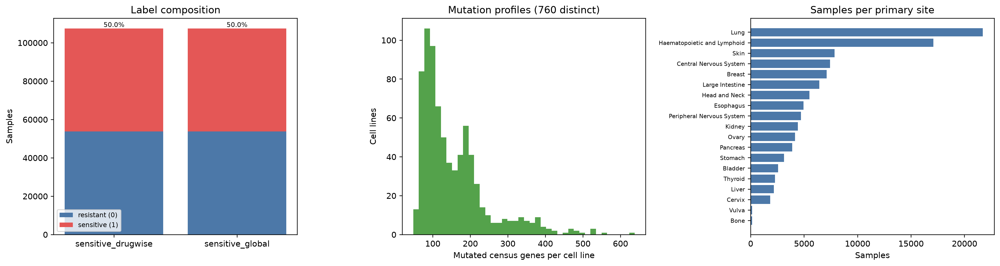

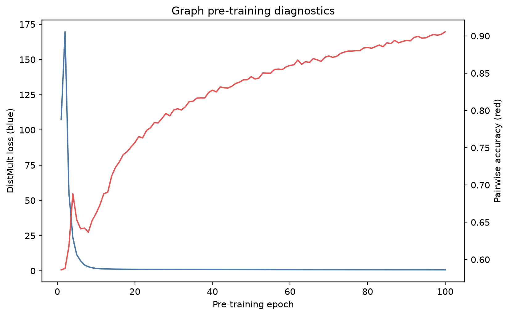

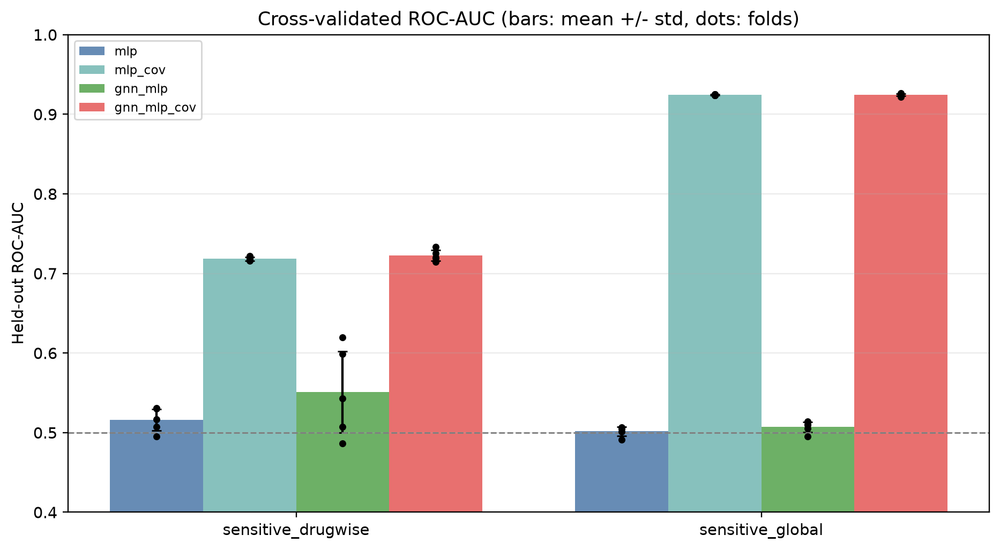

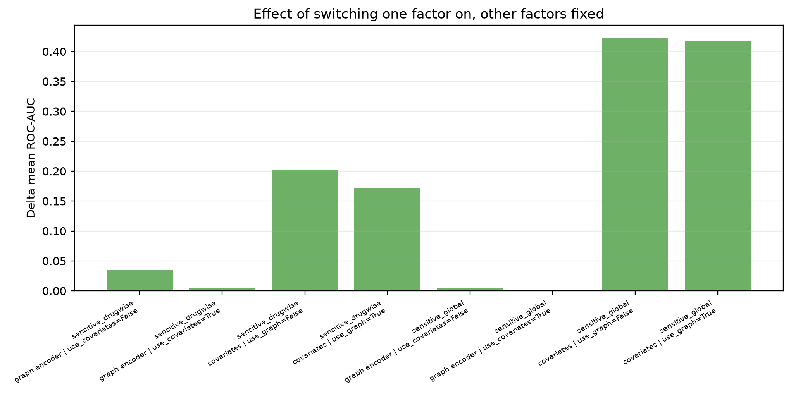

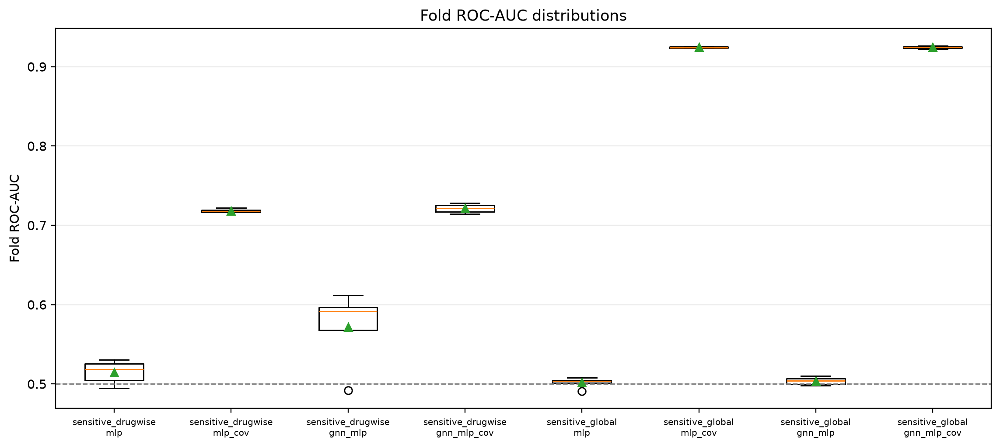

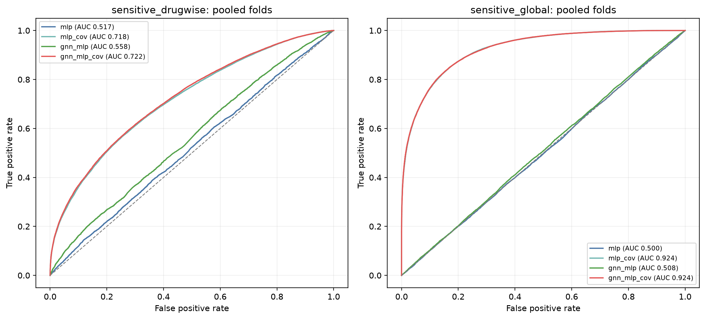

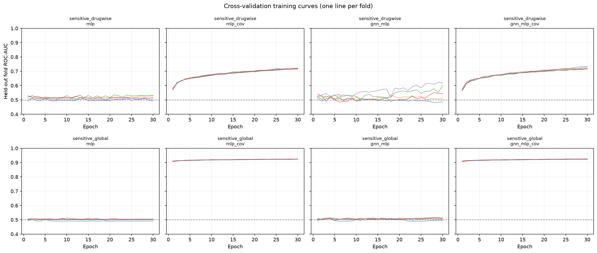

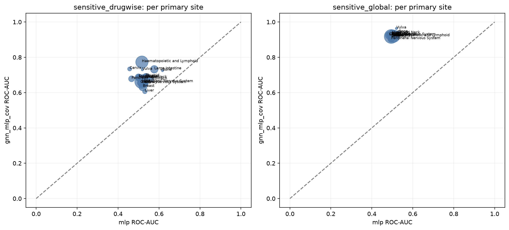

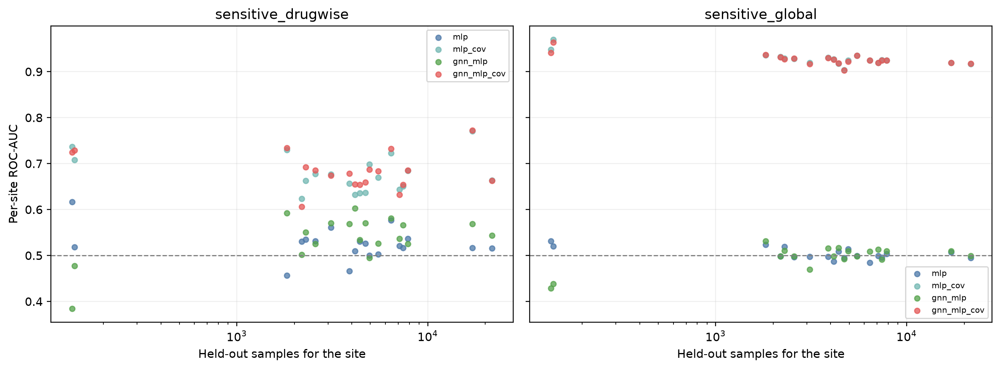

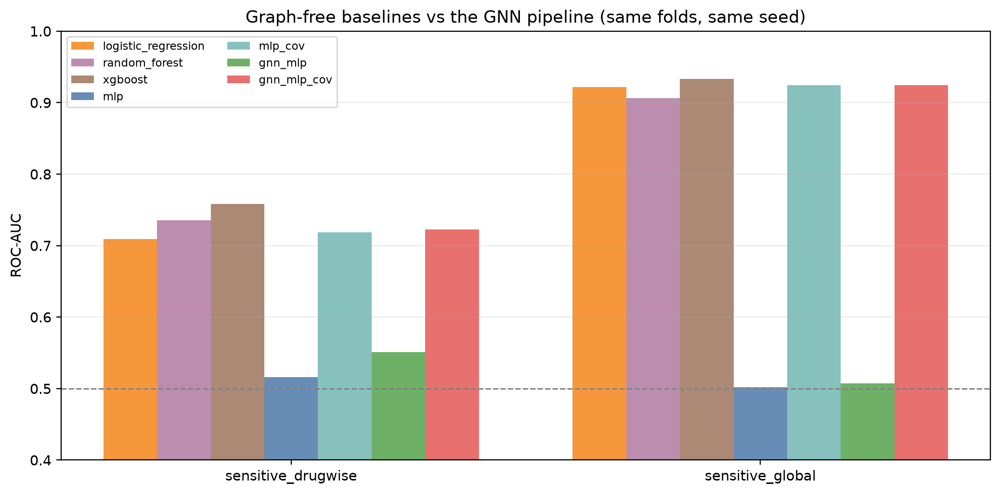

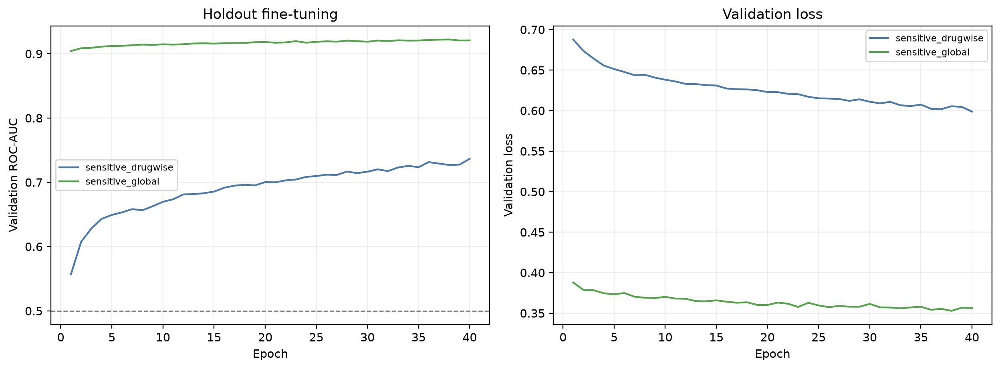

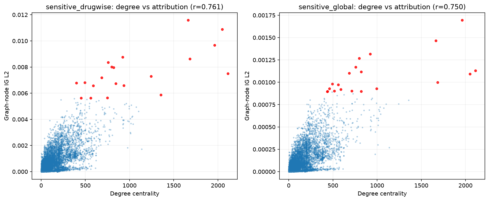

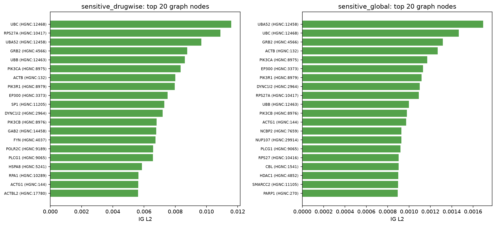

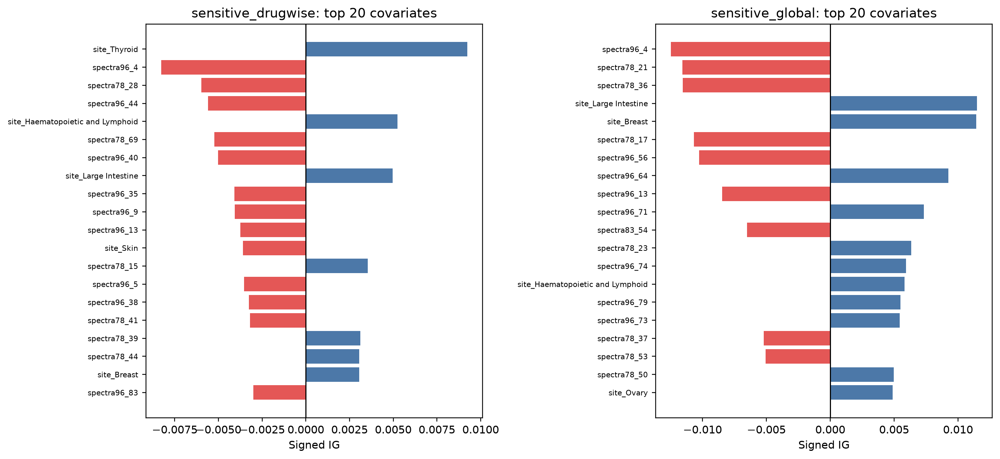

## Exact commands

    conda activate gnn
    # upstream GraphCDRScan stage, only needed to rebuild data_cdr/processed/
    python -m scripts.cdr.upstream.download_raw_data
    python -m scripts.cdr.upstream.prepare_data --config configs/cdr/upstream.json

    bash scripts/cdr/prepare.sh
    pathwaygnn pretrain  --config configs/cdr/pretrain.yaml
    pathwaygnn cv        --config configs/cdr/cv.yaml
    pathwaygnn finetune  --config configs/cdr/finetune_drugwise.yaml
    pathwaygnn finetune  --config configs/cdr/finetune_global.yaml
    pathwaygnn benchmark --config configs/cdr/benchmark_drugwise.yaml
    pathwaygnn benchmark --config configs/cdr/benchmark_global.yaml
    pathwaygnn ig        --config configs/cdr/ig_drugwise.yaml
    pathwaygnn ig        --config configs/cdr/ig_global.yaml
    pathwaygnn-data cdr-report --config configs/cdr/report.yaml

`bash scripts/cdr/reproduce.sh` runs the same list.

## Interpretation scope

These are the numbers this pipeline currently produces on this data, not a claim that the
architecture solves drug-response prediction. Read them with these caveats:

* **Tree baselines are the reference to beat.** On these folds, on sensitive_drugwise the best baseline (xgboost, 0.7582) beats the best pathwaygnn condition (gnn_mlp_cov, 0.7226); on sensitive_global the best baseline (xgboost, 0.9330) beats the best pathwaygnn condition (gnn_mlp_cov, 0.9244). The GNN pipeline is
  not the strongest model here; the graph earns its keep only in the covariate-free ablation, where
  it is the difference between chance and a weak but non-zero signal.
* **The two tasks are not equally hard by construction.** `sensitive_global` is largely a question
  about the compound, `sensitive_drugwise` largely a question about the cell line; comparing their
  AUCs against each other says more about the labels than about the model.
* **Folds are random over samples, not over cell lines or compounds.** A cell line appears in both
  the training and the held-out fold with different compounds, so these numbers describe filling in
  a partly observed response matrix, not generalisation to an unseen cell line.
* **The mutation channel is a scalar per gene.** GraphCDRScan's per-mutation node features (variant
  type, encoded genomic position) are reduced to a mutation count, because the sample-level head
  projects one value per gene. The spectra keep some of that information at the sample level.
* **These are current-release inputs, not the 2018 CDRscan experiment.** GraphCDRScan substitutes
  GDSC1 (Oct 2023), Cell Model Passports mutations on GRCh38 and RDKit fingerprints for the paper's
  GDSC 6.0, COSMIC v82 and PaDEL descriptors, so nothing here is comparable to published CDRscan
  numbers.
* **One pre-training run** feeds every downstream number; no seed sweep was performed, and the
  encoder is frozen during cross-validation (`end_to_end: false`).
