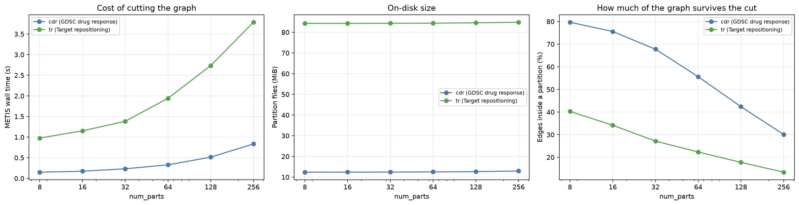

# PathwayGNN graph-partitioning benchmark

Graph partitioning (`training.partition` in `configs/*/pretrain_partitioned.yaml`) trades
fidelity for memory: more partitions mean smaller subgraphs per step and therefore less memory,
but also more edges cut and more steps per pass over the graph. This document is the measurement
of that trade-off, produced by `pathwaygnn dist-benchmark` and rendered by
`pathwaygnn-data dist-report`. It is generated -- edit the modules, not this file.

## How it was measured

| Setting | Value |
|---|---|
| Device | cuda:0 (NVIDIA RTX PRO 6000 Blackwell Max-Q Workstation Edition) |
| PyTorch / Python | 2.12.1+cu130 / 3.13.14 |
| Model | hidden_dim 64, num_layers 2, dropout 0.1 |
| Positive edges per step | 4096 |
| Timed steps per configuration | 5 (median), after 2 warmup steps |
| DataLoader workers | 0 |
| Memory metric | peak CUDA bytes allocated per step (parameters, gradients, optimizer state and activations) |
| Grid | num_parts [8, 16, 32, 64, 128, 256] x parts_per_batch [1, 2, 4, 8, 16, 32] |

Each timed step is one forward+backward+optimizer step of the real pre-training path, and the
peak memory is measured with parameters, gradients and optimizer state already resident, so it is
what has to fit rather than activations alone. Configurations with
`parts_per_batch > num_parts` are not measurable and are listed as skipped
(6 of them). One pass over the graph is **derived** from the median
per-step cost rather than timed end to end, so that the whole grid stays cheap to re-run.

## Graphs under test

| Dataset | Graph | Nodes | Relations | Edges | Encoder parameters | Full-graph step (ms) | Full-graph peak (MiB) |
|---|---|---|---|---|---|---|---|
| `cdr` | GDSC drug response | 13,606 | 356 | 536,274 | 9,788,296 | 509.3 | 14,450 |
| `tr` | Target repositioning | 30,895 | 13 | 3,671,958 | 2,310,874 | 30.2 | 1,506 |

**`cdr` — GDSC drug response.** The GraphCDRScan corpus: a Reactome functional-interaction graph, with one sample per (cell line, compound) pair. Its 356 relation types are what make the full-graph forward expensive, because `RelationalGIN` runs one GINConv per relation per layer.

**`tr` — Target repositioning.** The SLGCN-TR corpus: a PathwayCommons graph, classifying perturbation signatures against disease signatures. Far more edges than the drug-response graph but only 13 relation types, so it sits at the opposite end of the same cost model.

The last two columns are the un-partitioned baseline every partitioned number below is read against: one step over the whole graph, on the same model and optimizer. They are what decides whether partitioning is needed at all.

## Cutting the graph with METIS

This is the one-off cost, paid by `pathwaygnn partition` before training. `edges inside a partition` is the share of edges whose two endpoints land in the same partition; the rest are only seen when their two partitions share a batch, which is what the coverage tables further down measure.

| Dataset | num_parts | METIS s | disk MiB | nodes/part (mean) | min | max | edges inside a partition (%) | edgeless parts |
|---|---|---|---|---|---|---|---|---|
| `cdr` | 8 | 0.1503 | 12.3969 | 1700.7500 | 1651 | 1751 | 79.6820 | 0 |
| `cdr` | 16 | 0.1733 | 12.4150 | 850.3750 | 825 | 875 | 75.5726 | 0 |
| `cdr` | 32 | 0.2325 | 12.4519 | 425.1875 | 412 | 437 | 67.7717 | 0 |
| `cdr` | 64 | 0.3282 | 12.5264 | 212.5938 | 206 | 218 | 55.6011 | 0 |
| `cdr` | 128 | 0.5149 | 12.6722 | 106.2969 | 103 | 109 | 42.3649 | 0 |
| `cdr` | 256 | 0.8346 | 12.9643 | 53.1484 | 51 | 54 | 30.0511 | 0 |
| `tr` | 8 | 0.9771 | 84.2995 | 3861.8750 | 3749 | 3977 | 40.2804 | 0 |
| `tr` | 16 | 1.1525 | 84.3183 | 1930.9375 | 1874 | 1988 | 34.1520 | 0 |
| `tr` | 32 | 1.3835 | 84.3561 | 965.4688 | 937 | 994 | 27.1503 | 0 |
| `tr` | 64 | 1.9415 | 84.4299 | 482.7344 | 468 | 497 | 22.3455 | 0 |
| `tr` | 128 | 2.7342 | 84.5771 | 241.3672 | 234 | 248 | 17.7511 | 0 |
| `tr` | 256 | 3.7857 | 84.8683 | 120.6836 | 117 | 124 | 13.4164 | 0 |

## Dataset `cdr` — GDSC drug response

**Full-graph baseline** (no `training.partition` block): one step sees all 13,606 nodes and 536,274 edges, costs 509.3 ms and 14,450 MiB peak.

At the far end of the grid (`num_parts: 256`, `parts_per_batch: 1`) a step needs 255 MiB, i.e. **57x less memory** than the full graph -- but a pass over the graph takes 227x longer (115.6 s against 0.51 s) and sees only 30.1% of its edges. That is the trade the mode makes: memory, paid for in wall time and fidelity.

The four line panels below plot the `cdr` tables in this section — peak memory, step time, time per pass and edge coverage, each against `num_parts` with one line per `parts_per_batch`, and the full-graph baseline as the dashed line. The fifth panel drops `num_parts` and plots cost directly against the number of nodes a step sees, which is what the two knobs actually control.

### What a step sees

Columns are `parts_per_batch`.

Nodes per step (mean over a pass):

| num_parts | x1 | x2 | x4 | x8 | x16 | x32 |
|---|---|---|---|---|---|---|
| 8 | 1700 | 3401 | 6803 | 13606 | NA | NA |
| 16 | 850 | 1700 | 3401 | 6803 | 13606 | NA |
| 32 | 425 | 850 | 1700 | 3401 | 6803 | 13606 |
| 64 | 212 | 425 | 850 | 1700 | 3401 | 6803 |
| 128 | 106 | 212 | 425 | 850 | 1700 | 3401 |
| 256 | 53 | 106 | 212 | 425 | 850 | 1700 |

Edges per step (mean over a pass; METIS balances nodes, not edges, so single batches vary widely -- the TSV carries the min and max):

| num_parts | x1 | x2 | x4 | x8 | x16 | x32 |
|---|---|---|---|---|---|---|
| 8 | 53414.2500 | 112308.0000 | 232991.0000 | 536274.0000 | NA | NA |
| 16 | 25329.7500 | 51125.0000 | 105664.5000 | 228005.0000 | 536274.0000 | NA |
| 32 | 11357.5625 | 22881.6250 | 46901.5000 | 100259.0000 | 228347.0000 | 536274.0000 |
| 64 | 4658.9688 | 9423.3750 | 19436.8750 | 39982.0000 | 89833.0000 | 210316.0000 |
| 128 | 1774.9375 | 3581.2500 | 7235.3750 | 15031.8750 | 31992.5000 | 74140.0000 |
| 256 | 629.5156 | 1264.5781 | 2607.4375 | 5482.0000 | 11402.0000 | 26229.2500 |

Fraction of the graph's edges a pass sees at all (%). An edge is only visible when both endpoints land in the same batch, so this is the fidelity the configuration trains at; `shuffle: true` varies which edges those are per epoch:

| num_parts | x1 | x2 | x4 | x8 | x16 | x32 |
|---|---|---|---|---|---|---|
| 8 | 79.6820 | 83.7691 | 86.8925 | 100.0000 | NA | NA |
| 16 | 75.5726 | 76.2670 | 78.8138 | 85.0330 | 100.0000 | NA |
| 32 | 67.7717 | 68.2685 | 69.9665 | 74.7819 | 85.1606 | 100.0000 |
| 64 | 55.6011 | 56.2302 | 57.9909 | 59.6441 | 67.0053 | 78.4360 |
| 128 | 42.3649 | 42.7393 | 43.1742 | 44.8483 | 47.7256 | 55.3001 |
| 256 | 30.0511 | 30.1835 | 31.1177 | 32.7116 | 34.0184 | 39.1281 |

Steps per pass over all partitions:

| num_parts | x1 | x2 | x4 | x8 | x16 | x32 |
|---|---|---|---|---|---|---|
| 8 | 8 | 4 | 2 | 1 | NA | NA |
| 16 | 16 | 8 | 4 | 2 | 1 | NA |
| 32 | 32 | 16 | 8 | 4 | 2 | 1 |
| 64 | 64 | 32 | 16 | 8 | 4 | 2 |
| 128 | 128 | 64 | 32 | 16 | 8 | 4 |
| 256 | 256 | 128 | 64 | 32 | 16 | 8 |

### Peak memory per step (MiB)

| num_parts | x1 | x2 | x4 | x8 | x16 | x32 |
|---|---|---|---|---|---|---|
| 8 | 2017.3359 | 3771.9526 | 7374.2847 | 14525.1592 | NA | NA |
| 16 | 1098.2627 | 2000.2163 | 3802.1978 | 7424.4336 | 14525.1592 | NA |
| 32 | 639.3335 | 1095.8003 | 1993.9756 | 3796.7427 | 7359.8853 | 14525.1592 |
| 64 | 407.5537 | 635.9785 | 1082.0361 | 1975.6475 | 3762.4414 | 7349.6377 |
| 128 | 294.5078 | 403.3184 | 629.5386 | 1075.6616 | 1976.7202 | 3754.0322 |
| 256 | 255.3774 | 292.1431 | 405.2007 | 631.2700 | 1077.2051 | 1956.6934 |

### Median step time (ms)

| num_parts | x1 | x2 | x4 | x8 | x16 | x32 |
|---|---|---|---|---|---|---|
| 8 | 468.1272 | 488.7662 | 484.8916 | 493.4438 | NA | NA |
| 16 | 458.7783 | 468.1682 | 496.1654 | 484.4668 | 494.6101 | NA |
| 32 | 461.2366 | 454.6172 | 463.0292 | 484.3281 | 481.2014 | 512.8085 |
| 64 | 470.4953 | 462.2992 | 464.9527 | 467.7270 | 493.3056 | 500.6199 |
| 128 | 458.2280 | 454.2738 | 460.6017 | 466.4811 | 479.0838 | 494.4363 |
| 256 | 450.6174 | 450.6987 | 454.5051 | 462.4714 | 462.0073 | 465.2118 |

Median batch-load time (ms), i.e. reading the partition files and building the subgraph:

| num_parts | x1 | x2 | x4 | x8 | x16 | x32 |
|---|---|---|---|---|---|---|
| 8 | 2.5652 | 3.9514 | 6.5487 | 11.6142 | NA | NA |
| 16 | 2.4473 | 3.6682 | 5.7081 | 9.6137 | 17.4565 | NA |
| 32 | 1.8943 | 3.0043 | 4.9406 | 8.4500 | 14.6549 | 27.2941 |
| 64 | 1.4218 | 2.3954 | 4.2341 | 7.5159 | 14.1344 | 24.0794 |
| 128 | 1.4108 | 1.9975 | 3.7497 | 6.6653 | 12.1435 | 22.2240 |
| 256 | 0.9085 | 1.5850 | 2.8562 | 5.5234 | 10.0071 | 19.6774 |

### Derived time for one pass over the graph (s)

`steps_per_pass x (step + load)`, single process. Under `torchrun` the steps are divided across ranks.

| num_parts | x1 | x2 | x4 | x8 | x16 | x32 |
|---|---|---|---|---|---|---|
| 8 | 3.7655 | 1.9709 | 0.9829 | 0.5051 | NA | NA |
| 16 | 7.3796 | 3.7747 | 2.0075 | 0.9882 | 0.5121 | NA |
| 32 | 14.8202 | 7.3219 | 3.7438 | 1.9711 | 0.9917 | 0.5401 |
| 64 | 30.2027 | 14.8702 | 7.5070 | 3.8019 | 2.0298 | 1.0494 |
| 128 | 58.8338 | 29.2014 | 14.8592 | 7.5703 | 3.9298 | 2.0666 |
| 256 | 115.5906 | 57.8923 | 29.2711 | 14.9758 | 7.5522 | 3.8791 |

## Dataset `tr` — Target repositioning

**Full-graph baseline** (no `training.partition` block): one step sees all 30,895 nodes and 3,671,958 edges, costs 30.2 ms and 1,506 MiB peak.

At the far end of the grid (`num_parts: 256`, `parts_per_batch: 1`) a step needs 109 MiB, i.e. **14x less memory** than the full graph -- but a pass over the graph takes 201x longer (6.1 s against 0.03 s) and sees only 13.4% of its edges. That is the trade the mode makes: memory, paid for in wall time and fidelity.

The four line panels below plot the `tr` tables in this section — peak memory, step time, time per pass and edge coverage, each against `num_parts` with one line per `parts_per_batch`, and the full-graph baseline as the dashed line. The fifth panel drops `num_parts` and plots cost directly against the number of nodes a step sees, which is what the two knobs actually control.

### What a step sees

Columns are `parts_per_batch`.

Nodes per step (mean over a pass):

| num_parts | x1 | x2 | x4 | x8 | x16 | x32 |
|---|---|---|---|---|---|---|
| 8 | 3861 | 7723 | 15447 | 30895 | NA | NA |
| 16 | 1930 | 3861 | 7723 | 15447 | 30895 | NA |
| 32 | 965 | 1930 | 3861 | 7723 | 15447 | 30895 |
| 64 | 482 | 965 | 1930 | 3861 | 7723 | 15447 |
| 128 | 241 | 482 | 965 | 1930 | 3861 | 7723 |
| 256 | 120 | 241 | 482 | 965 | 1930 | 3861 |

Edges per step (mean over a pass; METIS balances nodes, not edges, so single batches vary widely -- the TSV carries the min and max):

| num_parts | x1 | x2 | x4 | x8 | x16 | x32 |
|---|---|---|---|---|---|---|
| 8 | 184884.7500 | 437961.5000 | 1205451.0000 | 3671958.0000 | NA | NA |
| 16 | 78378.0000 | 172749.7500 | 427729.0000 | 1166216.0000 | 3671958.0000 | NA |
| 32 | 31154.5625 | 67249.3750 | 158064.0000 | 405946.0000 | 1141038.0000 | 3671958.0000 |
| 64 | 12820.5625 | 27368.7500 | 61038.3750 | 143027.0000 | 367569.0000 | 1121127.0000 |
| 128 | 5092.2969 | 10481.9062 | 22203.3750 | 49919.1250 | 121966.7500 | 341807.0000 |
| 256 | 1924.3984 | 3955.9844 | 8275.8438 | 18326.6250 | 42580.7500 | 109219.2500 |

Fraction of the graph's edges a pass sees at all (%). An edge is only visible when both endpoints land in the same batch, so this is the fidelity the configuration trains at; `shuffle: true` varies which edges those are per epoch:

| num_parts | x1 | x2 | x4 | x8 | x16 | x32 |
|---|---|---|---|---|---|---|
| 8 | 40.2804 | 47.7088 | 65.6571 | 100.0000 | NA | NA |
| 16 | 34.1520 | 37.6365 | 46.5941 | 63.5201 | 100.0000 | NA |
| 32 | 27.1503 | 29.3029 | 34.4370 | 44.2212 | 62.1488 | 100.0000 |
| 64 | 22.3455 | 23.8510 | 26.5965 | 31.1609 | 40.0407 | 61.0643 |
| 128 | 17.7511 | 18.2693 | 19.3496 | 21.7515 | 26.5726 | 37.2343 |
| 256 | 13.4164 | 13.7901 | 14.4243 | 15.9711 | 18.5539 | 23.7953 |

Steps per pass over all partitions:

| num_parts | x1 | x2 | x4 | x8 | x16 | x32 |
|---|---|---|---|---|---|---|
| 8 | 8 | 4 | 2 | 1 | NA | NA |
| 16 | 16 | 8 | 4 | 2 | 1 | NA |
| 32 | 32 | 16 | 8 | 4 | 2 | 1 |
| 64 | 64 | 32 | 16 | 8 | 4 | 2 |
| 128 | 128 | 64 | 32 | 16 | 8 | 4 |
| 256 | 256 | 128 | 64 | 32 | 16 | 8 |

### Peak memory per step (MiB)

| num_parts | x1 | x2 | x4 | x8 | x16 | x32 |
|---|---|---|---|---|---|---|
| 8 | 284.3081 | 504.0312 | 1002.1108 | 2020.3979 | NA | NA |
| 16 | 184.3604 | 285.4673 | 485.7241 | 934.1885 | 2018.5591 | NA |
| 32 | 139.3618 | 178.3301 | 275.1484 | 477.7822 | 925.7964 | 2018.5591 |
| 64 | 119.8179 | 138.2627 | 178.8433 | 268.7930 | 467.7637 | 911.2827 |
| 128 | 109.5684 | 118.6685 | 138.5083 | 177.9316 | 265.4463 | 464.2949 |
| 256 | 108.7827 | 109.6592 | 118.7285 | 136.4053 | 174.2480 | 263.0479 |

### Median step time (ms)

| num_parts | x1 | x2 | x4 | x8 | x16 | x32 |
|---|---|---|---|---|---|---|
| 8 | 24.7099 | 23.8831 | 25.1956 | 30.7439 | NA | NA |
| 16 | 23.6830 | 25.5762 | 25.7450 | 25.4315 | 30.0575 | NA |
| 32 | 23.1353 | 23.3608 | 24.5819 | 24.0881 | 25.4446 | 30.5528 |
| 64 | 22.6713 | 22.3541 | 22.7855 | 24.6419 | 23.6431 | 24.7403 |
| 128 | 23.3338 | 22.7467 | 22.5683 | 22.4302 | 25.1526 | 23.9825 |
| 256 | 22.3658 | 22.8332 | 23.2974 | 23.1010 | 23.4126 | 24.6123 |

Median batch-load time (ms), i.e. reading the partition files and building the subgraph:

| num_parts | x1 | x2 | x4 | x8 | x16 | x32 |
|---|---|---|---|---|---|---|
| 8 | 6.6321 | 10.9344 | 25.0107 | 41.5502 | NA | NA |
| 16 | 4.0819 | 6.3758 | 12.8563 | 25.9346 | 53.6425 | NA |
| 32 | 2.4538 | 3.9504 | 7.1019 | 13.5200 | 27.7495 | 65.8433 |
| 64 | 2.1042 | 3.6006 | 5.5390 | 10.1487 | 17.6371 | 43.0198 |
| 128 | 1.3572 | 2.6625 | 5.0112 | 8.0540 | 14.3788 | 27.4880 |
| 256 | 1.3714 | 2.3451 | 3.8640 | 6.9040 | 12.5740 | 23.3951 |

### Derived time for one pass over the graph (s)

`steps_per_pass x (step + load)`, single process. Under `torchrun` the steps are divided across ranks.

| num_parts | x1 | x2 | x4 | x8 | x16 | x32 |
|---|---|---|---|---|---|---|
| 8 | 0.2507 | 0.1393 | 0.1004 | 0.0723 | NA | NA |
| 16 | 0.4442 | 0.2556 | 0.1544 | 0.1027 | 0.0837 | NA |
| 32 | 0.8189 | 0.4370 | 0.2535 | 0.1504 | 0.1064 | 0.0964 |
| 64 | 1.5856 | 0.8305 | 0.4532 | 0.2783 | 0.1651 | 0.1355 |
| 128 | 3.1605 | 1.6262 | 0.8825 | 0.4877 | 0.3163 | 0.2059 |
| 256 | 6.0767 | 3.2228 | 1.7383 | 0.9602 | 0.5758 | 0.3841 |

## Reading the numbers

- **Memory tracks the subgraph a step sees, not `num_parts` itself.** `num_parts` and
  `parts_per_batch` only matter through their ratio: doubling `num_parts` at fixed
  `parts_per_batch` halves the nodes per step, and doubling `parts_per_batch` puts them back.
  The rightmost panel of each graph's figure is that relationship, with the full-graph point on
  the same axes.
- **Per-step time falls much less than memory.** One `RelationalGIN` layer runs one GINConv per
  relation whatever the subgraph size, so a graph with many relations pays a fixed per-step cost
  that shrinking the subgraph cannot remove. Time per *pass over the graph* therefore rises with
  `num_parts` even as memory falls -- partitioning buys memory, and buys it with wall time.
- **Cutting more finely cuts more edges.** The `edges inside a partition` column is the fraction
  of edges both of whose endpoints land in the same partition. Edges between two partitions are
  still trained on whenever those partitions share a batch, which is why `shuffle: true` matters:
  it varies the pairings across epochs.
- **Batch-load time is real and grows with `parts_per_batch`.** It is measured with
  `num_workers: 0` so it shows up; set `training.partition.num_workers` above zero in a real run
  and it overlaps with compute.
- **The partitioned path carries a small fixed overhead**, so where a batch covers most of the
  graph it can need slightly *more* memory than the full-graph path -- visible wherever a line
  sits above the dashed baseline. It gathers the subgraph's rows out of the embedding table, and
  that gather plus its gradient is an extra pair of tensors the full-graph path does not
  materialize. It is only worth paying where the ratio actually shrinks the subgraph.

## Choosing a configuration

Work from each graph's own section: **Peak memory per step** fixes what fits, **Fraction of the graph's edges a pass
sees** says what that costs in fidelity, and **Derived time for one pass** says what it costs in
wall time. `Graphs under test` holds the un-partitioned upper bound on both fidelity and memory. A configuration is only worth using when the full-graph row does not fit -- the
partitioned objective is not the same objective, so it is a mechanism for graphs that do not fit,
not a speedup for graphs that do. Note how differently the two corpora here land: the graph with
356 relations needs 14 GiB un-partitioned and is the case the mode exists for, while the one with
13 relations already fits in 1.5 GiB and has nothing to gain.

Under `torchrun` the steps of a pass are divided across ranks
(`DistributedSampler`), so wall time per epoch falls with the rank count while the per-step
memory above stays as measured.
