# PathwayGNN target repositioning report

## What this report covers

Dataset **tr** at `data_tr/processed`, prepared
into `data_tr/prepared`: 30,895 graph nodes, 3,671,958 directed
edges, 13 relation types, tasks kd_inh, oe_act. Run status: 4 cross-validation conditions, 2 holdout runs, 2 baseline runs, 2 attribution runs.
Graph pre-training: 100 epochs, final DistMult loss 0.9667, final pairwise accuracy 0.8669.

Every number below comes from artifacts under `outputs/tr/`, and every table is also written as TSV
under `outputs/tr/report/`. Cross-validation and the graph-free baselines use the same stratified 5-fold
split (seed 42, `StratifiedKFold(shuffle=True)`), so those model comparisons are on identical folds;
attribution runs on fold 0 of the graph variant, and holdout fine-tuning uses its own 70/15/15 split.

## Dataset audit

| task | samples | positive | positive_ratio | perturbations | diseases_used | diseases_total | mean_genes_perturbation | mean_genes_disease | signature_genes_skipped | label_rows_skipped |
|---|---|---|---|---|---|---|---|---|---|---|
| kd_inh | 61101 | 5013 | 0.0820 | 33817 | 31 | 177 | 975 | 994 | 2 | 255 |
| oe_act | 3465 | 294 | 0.0848 | 20131 | 15 | 177 | 975 | 994 | 2 | 0 |

`diseases_used` counts the diseases that actually appear in a task's labels, out of
`diseases_total` in the shared disease table. The `mean_genes_*` columns are the mean number of
non-zero genes per row of each node-level feature after the 1e-7 cutoff.

## Cross-validation (`pathwaygnn cv`)

| task | variant | uses_graph | mean_auc | std_auc | mean_accuracy | mean_precision | mean_recall | mean_f1 | min_fold_auc | max_fold_auc | pooled_auc | folds |
|---|---|---|---|---|---|---|---|---|---|---|---|---|
| kd_inh | mlp | False | 0.5152 | 0.0309 | 0.3975 | 0.0759 | 0.6421 | 0.1237 | 0.4988 | 0.5769 | 0.5172 | 5 |
| kd_inh | gnn_mlp | True | 0.5000 | 0.0000 | 0.4164 | 0.0492 | 0.6000 | 0.0910 | 0.5000 | 0.5000 | 0.5001 | 5 |
| oe_act | mlp | False | 0.7059 | 0.0410 | 0.7218 | 0.1735 | 0.6054 | 0.2693 | 0.6412 | 0.7645 | 0.6988 | 5 |
| oe_act | gnn_mlp | True | 0.7133 | 0.0471 | 0.8609 | 0.3094 | 0.5170 | 0.3858 | 0.6532 | 0.7905 | 0.7085 | 5 |

`pooled_auc` is computed once over the concatenated held-out predictions of all folds, which is why
it can sit outside the min/max of the per-fold values. The `mean_accuracy`/`precision`/`recall`/`f1`
columns score the same folds at a fixed **0.5 decision threshold**; ROC-AUC is threshold-free, so a
condition can rank well and still sit at a poor operating point (or the reverse).

`cv` weights the positive class by `pos_weight` (10.75–11.19 across folds, i.e. negatives/positives of each fold's training split), which is the rule `finetune` uses, so both protocols optimise the same loss; the 0.5 operating point is therefore comparable between the two tables.

Effect of the graph encoder:

| task | baseline | baseline_auc | graph_variant | graph_auc | delta |
|---|---|---|---|---|---|
| kd_inh | mlp | 0.5152 | gnn_mlp | 0.5000 | -0.0152 |
| oe_act | mlp | 0.7059 | gnn_mlp | 0.7133 | 0.0075 |

## Graph-free baselines (`pathwaygnn benchmark`)

| task | model | auc | accuracy | precision | recall | f1 |
|---|---|---|---|---|---|---|
| kd_inh | logistic_regression | 0.7550 | 0.7049 | 0.1714 | 0.6774 | 0.2736 |
| kd_inh | random_forest | 0.8086 | 0.9147 | 0.4260 | 0.1145 | 0.1803 |
| kd_inh | xgboost | 0.8025 | 0.9186 | 0.6611 | 0.0164 | 0.0319 |
| kd_inh | mlp (pathwaygnn cv) | 0.5152 | 0.3975 | 0.0759 | 0.6421 | 0.1237 |
| kd_inh | gnn_mlp (pathwaygnn cv) | 0.5000 | 0.4164 | 0.0492 | 0.6000 | 0.0910 |
| oe_act | logistic_regression | 0.4342 | 0.7417 | 0.0831 | 0.2041 | 0.1181 |
| oe_act | random_forest | 0.8032 | 0.9140 | 0.4945 | 0.3606 | 0.4164 |
| oe_act | xgboost | 0.7197 | 0.9039 | 0.1477 | 0.0341 | 0.0553 |
| oe_act | mlp (pathwaygnn cv) | 0.7059 | 0.7218 | 0.1735 | 0.6054 | 0.2693 |
| oe_act | gnn_mlp (pathwaygnn cv) | 0.7133 | 0.8609 | 0.3094 | 0.5170 | 0.3858 |

The baselines consume exactly the same features as the GNN — the sparse perturbation and disease
signatures — without the pathway graph. All five metrics are on the same footing: both sides are
the mean over the same five folds, and both threshold at 0.5.

## Holdout fine-tuning (`pathwaygnn finetune`)

| task | train | valid | test | epochs_run | best_epoch | best_valid_auc | test_auc | test_accuracy | test_precision | test_recall | test_f1 | test_predicted_positive_ratio |
|---|---|---|---|---|---|---|---|---|---|---|---|---|
| kd_inh | 42770 | 9164 | 9167 | 22 | 2 | 0.6128 | 0.5869 | 0.4498 | 0.0996 | 0.7092 | 0.1747 | 0.5846 |
| oe_act | 2424 | 519 | 522 | 45 | 25 | 0.6999 | 0.6451 | 0.9176 | 0.5385 | 0.3111 | 0.3944 | 0.0498 |

This protocol is a single stratified 70/15/15 split with early stopping on validation ROC-AUC and
`pos_weight` from the training class ratio, so its numbers are not directly comparable with the
5-fold results above. Compare `best_valid_auc` with `test_auc`: on oe_act the validation split holds
only a few dozen samples, so selecting on it overstates the held-out result. Note also that
`test_predicted_positive_ratio` reveals when a model simply predicts the positive class for
everything, which is what `pos_weight` encourages on these imbalanced labels.

## Per-disease breakdown

Top 15 diseases per task by held-out sample count:

| task | disease | samples | positives | auc_mlp | auc_gnn_mlp |
|---|---|---|---|---|---|
| kd_inh | DOID:0050156 | 1971 | 131 | 0.4816 | 0.4970 |
| kd_inh | DOID:0050589 | 1971 | 166 | 0.5176 | 0.5285 |
| kd_inh | DOID:1040 | 1971 | 41 | 0.4766 | 0.5122 |
| kd_inh | DOID:10534 | 1971 | 211 | 0.5014 | 0.5120 |
| kd_inh | DOID:10652 | 1971 | 47 | 0.4722 | 0.4403 |
| kd_inh | DOID:12449 | 1971 | 50 | 0.5029 | 0.4764 |
| kd_inh | DOID:1380 | 1971 | 8 | 0.5539 | 0.5966 |
| kd_inh | DOID:13810 | 1971 | 65 | 0.4511 | 0.5099 |
| kd_inh | DOID:14330 | 1971 | 55 | 0.5286 | 0.5044 |
| kd_inh | DOID:1612 | 1971 | 581 | 0.5126 | 0.5107 |
| kd_inh | DOID:1793 | 1971 | 280 | 0.5421 | 0.4834 |
| kd_inh | DOID:1883 | 1971 | 8 | 0.5031 | 0.5868 |
| kd_inh | DOID:1909 | 1971 | 163 | 0.4902 | 0.4875 |
| kd_inh | DOID:2394 | 1971 | 222 | 0.5357 | 0.5077 |
| kd_inh | DOID:2841 | 1971 | 85 | 0.4662 | 0.4858 |
| oe_act | DOID:0050589 | 231 | 9 | 0.4590 | 0.4585 |
| oe_act | DOID:1206 | 231 | 10 | 0.5941 | 0.5919 |
| oe_act | DOID:14330 | 231 | 18 | 0.4293 | 0.5363 |
| oe_act | DOID:1612 | 231 | 46 | 0.4150 | 0.5401 |
| oe_act | DOID:2394 | 231 | 9 | 0.5060 | 0.2630 |
| oe_act | DOID:3265 | 231 | 9 | 0.7733 | 0.5148 |
| oe_act | DOID:4450 | 231 | 27 | 0.6037 | 0.5154 |
| oe_act | DOID:676 | 231 | 9 | 0.5596 | 0.4107 |
| oe_act | DOID:7148 | 231 | 9 | 0.4865 | 0.5160 |
| oe_act | DOID:8552 | 231 | 9 | 0.5801 | 0.5616 |
| oe_act | DOID:9119 | 231 | 8 | 0.4582 | 0.4210 |
| oe_act | DOID:9256 | 231 | 10 | 0.3181 | 0.3158 |
| oe_act | DOID:9352 | 231 | 103 | 0.4075 | 0.4919 |
| oe_act | DOID:9538 | 231 | 9 | 0.4254 | 0.4464 |
| oe_act | DOID:9744 | 231 | 9 | 0.5485 | 0.4249 |

The full table for every disease is in `outputs/tr/report/per_disease_auc.tsv`.

## Integrated Gradients (`pathwaygnn ig`)

| task | rank | node | ig_l2 | degree |
|---|---|---|---|---|
| kd_inh | 1 | CHEBI:60654 | 0.0016 | 28022 |
| kd_inh | 2 | CHEBI:4667 | 0.0016 | 28022 |
| kd_inh | 3 | CHEBI:39867 | 0.0015 | 28076 |
| kd_inh | 4 | CHEBI:9925 | 0.0015 | 28022 |
| kd_inh | 5 | CHEBI:2504 | 0.0012 | 19418 |
| kd_inh | 6 | CHEBI:23965 | 0.0011 | 11310 |
| kd_inh | 7 | CHEBI:33364 | 0.0011 | 13036 |
| kd_inh | 8 | CHEBI:4031 | 0.0010 | 16036 |
| kd_inh | 9 | CHEBI:28748 | 0.0010 | 13572 |
| kd_inh | 10 | CHEBI:23414 | 0.0010 | 11862 |
| kd_inh | 11 | CHEBI:27899 | 0.0009 | 13032 |
| kd_inh | 12 | CHEBI:29678 | 0.0009 | 9424 |
| kd_inh | 13 | CHEBI:64816 | 0.0009 | 13544 |
| kd_inh | 14 | CHEBI:31440 | 0.0009 | 11862 |
| kd_inh | 15 | CHEBI:29865 | 0.0009 | 13518 |
| oe_act | 1 | CHEBI:60654 | 0.0076 | 28022 |
| oe_act | 2 | CHEBI:39867 | 0.0066 | 28076 |
| oe_act | 3 | CHEBI:4667 | 0.0060 | 28022 |
| oe_act | 4 | CHEBI:9925 | 0.0055 | 28022 |
| oe_act | 5 | CHEBI:2504 | 0.0046 | 19418 |
| oe_act | 6 | CHEBI:4031 | 0.0046 | 16036 |
| oe_act | 7 | CHEBI:31440 | 0.0044 | 11862 |
| oe_act | 8 | CHEBI:33364 | 0.0044 | 13036 |
| oe_act | 9 | MYC | 0.0042 | 10080 |
| oe_act | 10 | CHEBI:23965 | 0.0041 | 11310 |
| oe_act | 11 | CHEBI:28748 | 0.0041 | 13572 |
| oe_act | 12 | JUN | 0.0040 | 8654 |
| oe_act | 13 | CHEBI:23414 | 0.0039 | 11862 |
| oe_act | 14 | CHEBI:64816 | 0.0039 | 13544 |
| oe_act | 15 | EGFR | 0.0036 | 5996 |

Top 10 attributed genes per node-level feature:

| task | node_feature | rank | node | signed_ig |
|---|---|---|---|---|
| kd_inh | perturbation | 1 | PCNA | 0.0000 |
| kd_inh | perturbation | 2 | FBXO11 | -0.0000 |
| kd_inh | perturbation | 3 | KIAA0753 | -0.0000 |
| kd_inh | perturbation | 4 | C2CD2 | -0.0000 |
| kd_inh | perturbation | 5 | HSPA8 | 0.0000 |
| kd_inh | perturbation | 6 | IKZF1 | -0.0000 |
| kd_inh | perturbation | 7 | SQOR | -0.0000 |
| kd_inh | perturbation | 8 | ABHD4 | -0.0000 |
| kd_inh | perturbation | 9 | DENND2D | -0.0000 |
| kd_inh | perturbation | 10 | WFS1 | -0.0000 |
| kd_inh | disease | 1 | DDX17 | -0.0000 |
| kd_inh | disease | 2 | MYOM2 | -0.0000 |
| kd_inh | disease | 3 | ATF3 | 0.0000 |
| kd_inh | disease | 4 | INS | 0.0000 |
| kd_inh | disease | 5 | NME1 | 0.0000 |
| kd_inh | disease | 6 | RPS4Y1 | 0.0000 |
| kd_inh | disease | 7 | SCGB1A1 | 0.0000 |
| kd_inh | disease | 8 | ANKRD7 | -0.0000 |
| kd_inh | disease | 9 | IGHA2 | 0.0000 |
| kd_inh | disease | 10 | FABP4 | 0.0000 |
| oe_act | perturbation | 1 | MAP7 | 0.0000 |
| oe_act | perturbation | 2 | SESN1 | 0.0000 |
| oe_act | perturbation | 3 | DHDDS | 0.0000 |
| oe_act | perturbation | 4 | PLCB3 | 0.0000 |
| oe_act | perturbation | 5 | C2CD2 | 0.0000 |
| oe_act | perturbation | 6 | VAT1 | -0.0000 |
| oe_act | perturbation | 7 | ADAT1 | 0.0000 |
| oe_act | perturbation | 8 | FAIM | 0.0000 |
| oe_act | perturbation | 9 | SNX11 | 0.0000 |
| oe_act | perturbation | 10 | ABHD4 | 0.0000 |
| oe_act | disease | 1 | IFITM3 | -0.0000 |
| oe_act | disease | 2 | RPS18 | -0.0000 |
| oe_act | disease | 3 | RPSA | -0.0000 |
| oe_act | disease | 4 | FTL | -0.0000 |
| oe_act | disease | 5 | IGHA2 | 0.0000 |
| oe_act | disease | 6 | IFITM1 | -0.0000 |
| oe_act | disease | 7 | DEFA1B | -0.0000 |
| oe_act | disease | 8 | IGHG4 | 0.0000 |
| oe_act | disease | 9 | IGHG1 | 0.0000 |
| oe_act | disease | 10 | MYOM2 | 0.0000 |

Degree/attribution Pearson correlation:
kd_inh r=0.745 (50 samples, 50 steps), oe_act r=0.829 (50 samples, 50 steps).

Attribution mass concentrates on the highest-degree nodes, and the top of the ranking is dominated
by PathwayCommons chemical entities (`CHEBI:*`) rather than genes — the same degree-driven pattern
the cancer reproduction reports. Read the ranking as where the encoder puts its mass, not as
evidence of a disease-specific mechanism; the per-feature table below is the gene-level view.

## Plots

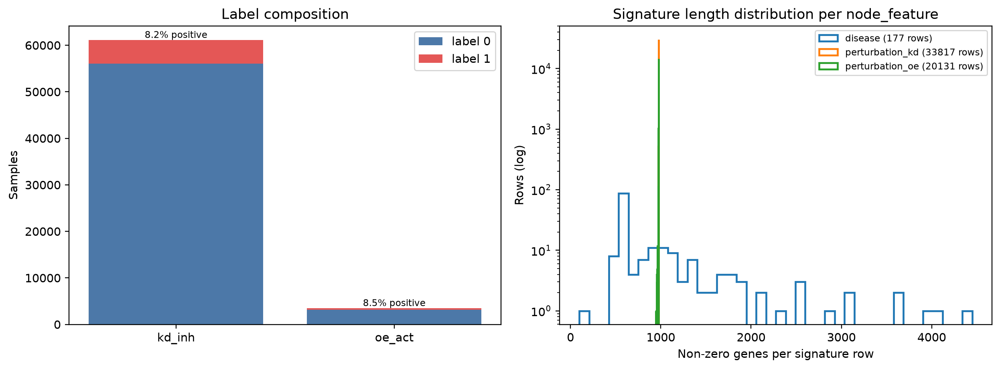

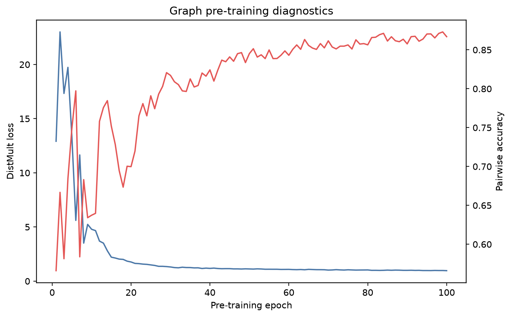

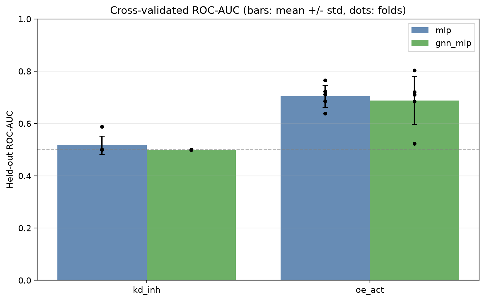

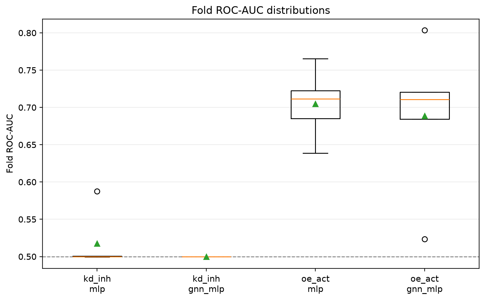

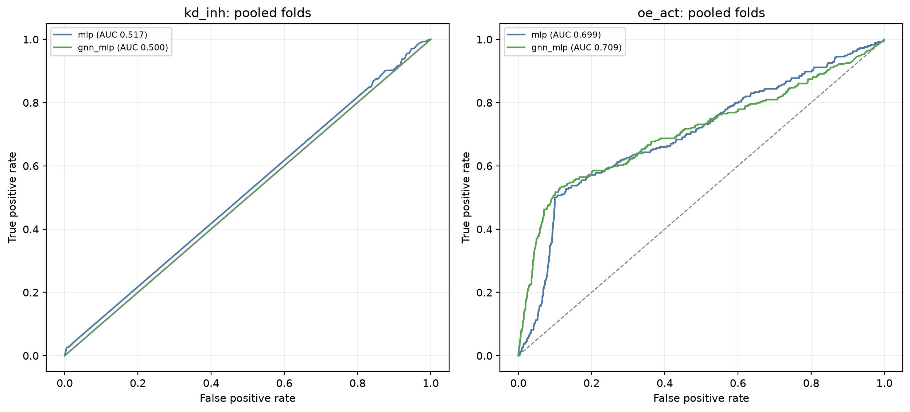

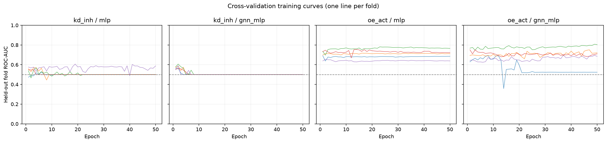

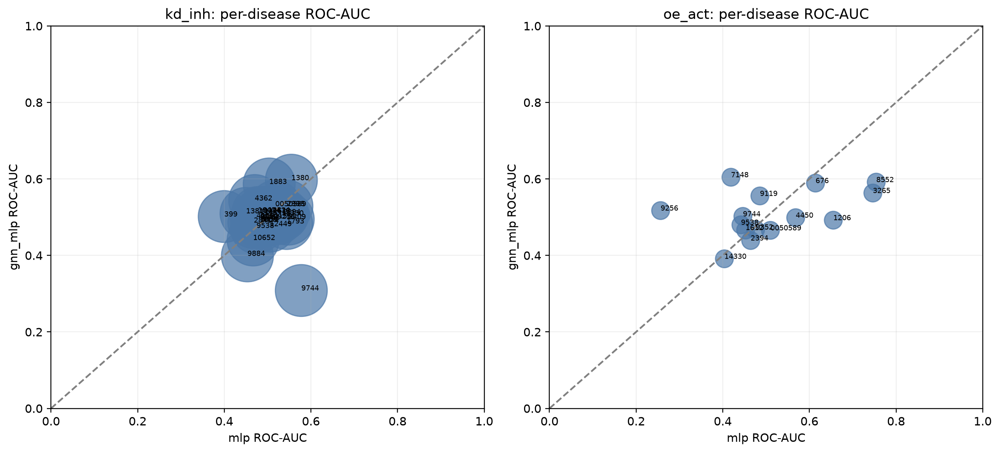

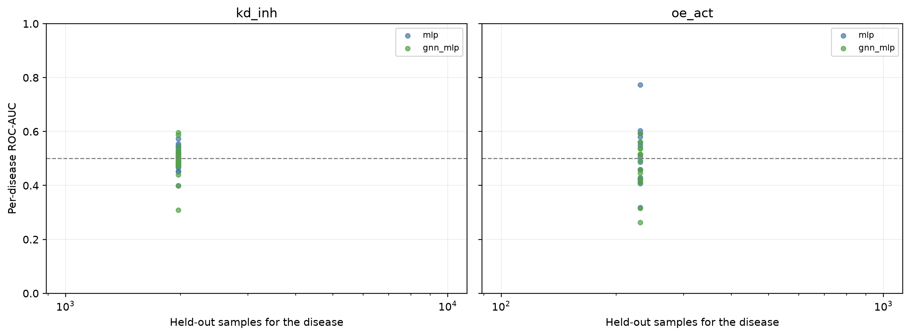

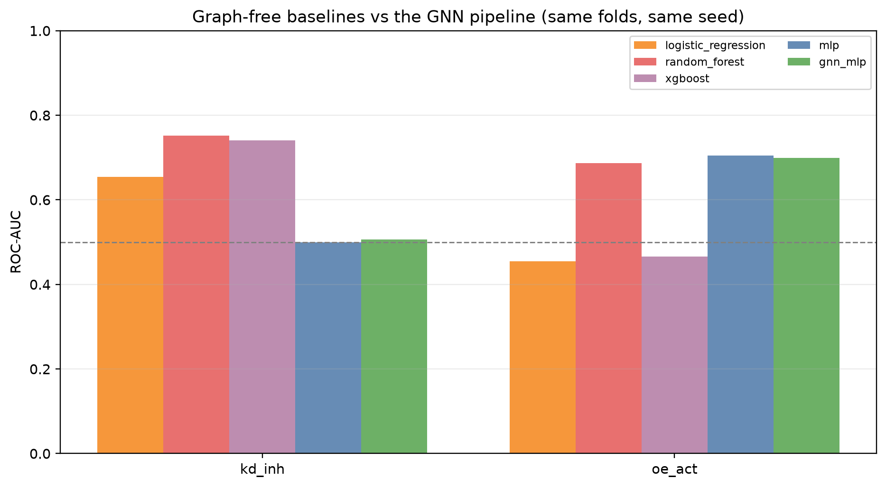

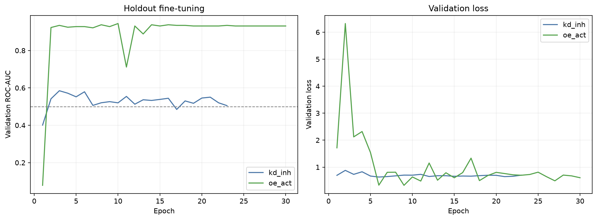

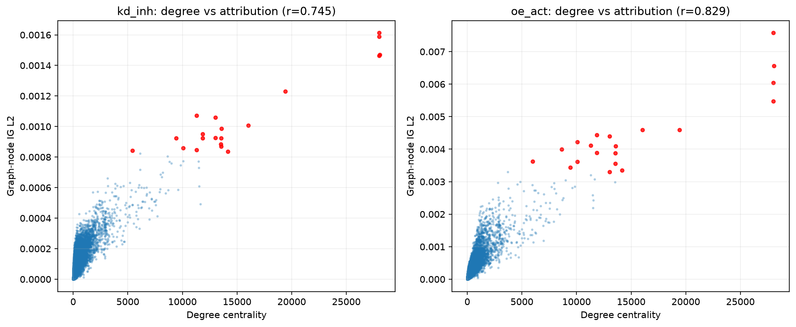

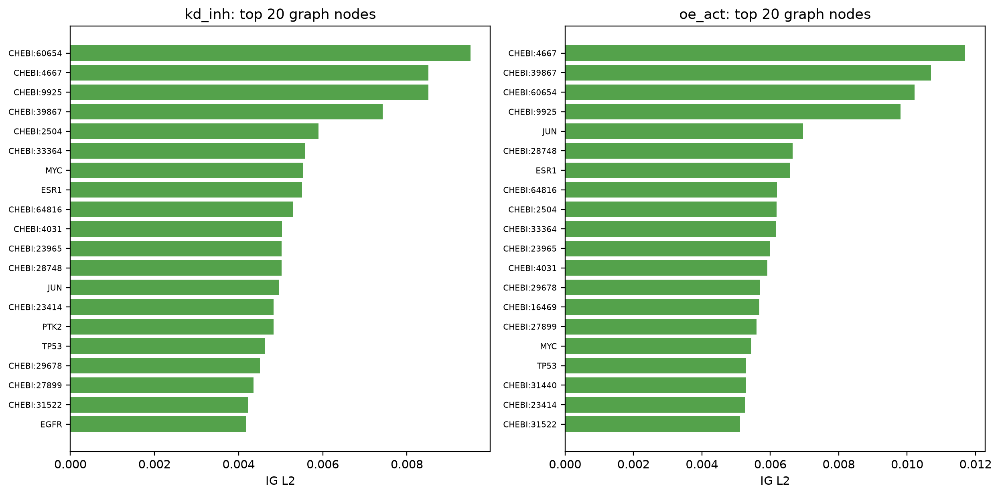

## Exact commands

    conda activate gnn
    bash scripts/tr/prepare.sh
    pathwaygnn pretrain  --config configs/tr/pretrain.yaml
    pathwaygnn cv        --config configs/tr/cv.yaml
    pathwaygnn finetune  --config configs/tr/finetune_kd_inh.yaml
    pathwaygnn finetune  --config configs/tr/finetune_oe_act.yaml
    pathwaygnn benchmark --config configs/tr/benchmark_kd_inh.yaml
    pathwaygnn benchmark --config configs/tr/benchmark_oe_act.yaml
    pathwaygnn ig        --config configs/tr/ig_kd_inh.yaml
    pathwaygnn ig        --config configs/tr/ig_oe_act.yaml
    pathwaygnn-data tr-report --config configs/tr/report.yaml

## Interpretation scope

These are the numbers this pipeline currently produces on this data, not a claim that the
architecture works on this task. Read them with three caveats:

* **kd_inh sits at chance** for both variants while the tree baselines reach far higher ROC-AUC on
  the identical folds. On this task the graph pipeline extracts less than plain feature models do.
* **oe_act is small** (3465 samples,
  294 positive), so its fold spread is wide and the
  mean over five folds is a weak estimate.
* **One pre-training run** feeds every downstream number; no seed sweep was performed, and the
  encoder is frozen by default (`end_to_end: false` in `configs/tr/cv.yaml`).

Per-disease ROC-AUC is undefined wherever a disease's held-out samples are single-class, and is
reported as NA in that case.
